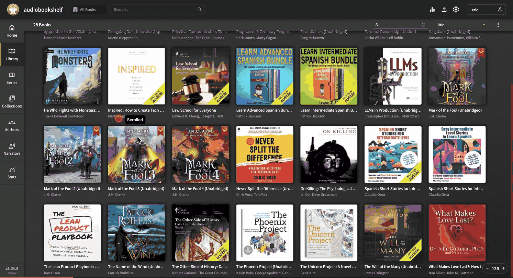

# How-To: Add Audiobooks to Audiobookshelf

**Purpose**: Guide for copying audiobooks downloaded with Libation into the NAS storage used by Audiobookshelf

**Scope**: File transfer from a local machine to the NAS-backed Audiobookshelf library, including folder structure requirements

**Overview**: Audiobookshelf reads audiobook files from an NFS-mounted directory on the NAS at
    `/volume1/k8s-homelab/media/audiobooks/Books/`. Libation downloads audiobooks to
    `~/Music/Libation/Books/` in a compatible folder structure (`Title [ASIN]/file.m4b`).
    This guide covers transferring those files to the NAS so Audiobookshelf discovers them.

**Dependencies**: Audiobookshelf deployed on K3s (`apps/audiobookshelf/`), NAS reachable via SSH, Libation audiobooks on local machine

**Exports**: Audiobooks available in the Audiobookshelf web UI for streaming

**Related**: how-to-deploy-a-new-app.md, storage/README.md

**Difficulty**: beginner

---

## Prerequisites

- **Audiobookshelf** is deployed and running (`kubectl get pods -n audiobookshelf`)
- **SSH access** to the NAS (`ssh eric@nas` with password or public key)
- **Audiobooks** downloaded with Libation at `~/Music/Libation/Books/`

## Folder Structure

Libation downloads audiobooks in this structure:

```
~/Music/Libation/Books/
├── Book Title [ASIN]/
│   ├── Book Title [ASIN].m4b
│   └── Book Title [ASIN].pdf    (optional companion PDF)
├── Another Book [ASIN]/
│   └── Another Book [ASIN].m4b
└── ...
```

Audiobookshelf accepts this structure directly using the "Book" library type (no author-level grouping required). The `[ASIN]` tags in folder names are ignored by Audiobookshelf during metadata matching.

On the NAS, audiobooks live at:

```
/volume1/k8s-homelab/media/audiobooks/Books/
```

This path is NFS-mounted into the Audiobookshelf pod at `/audiobooks/Books/`.

## Steps

### Step 1: Verify NAS Connectivity

```bash
ssh eric@nas "echo OK"
```

If this fails, check that:
- Tailscale is connected for SSH access to the NAS (`tailscale status`)
- The NAS node key has not expired (see Tailscale admin console)
- Your SSH key is authorized on the NAS (use `ssh-copy-id eric@nas` if needed)

### Step 2: Transfer Audiobooks via tar-over-SSH

macOS does not support NFS mounts, and the UGOS NAS restricts `rsync` and `scp` paths. Use `tar` piped over SSH for reliable transfers:

```bash
tar cf - -C ~/Music/Libation Books \
  | pv -s $(du -sk ~/Music/Libation/Books | awk '{print $1 * 1024}') \
  | ssh eric@nas "tar xf - -C /volume1/k8s-homelab/media/audiobooks/"
```

This streams the files directly to the NAS disk. Install `pv` for a progress bar (`brew install pv`). The `pv` step is optional — remove it from the pipeline if not needed.

**Without progress bar:**

```bash
tar cf - -C ~/Music/Libation Books \
  | ssh eric@nas "tar xf - -C /volume1/k8s-homelab/media/audiobooks/"
```

### Step 3: Verify Files on NAS

```bash
ssh eric@nas "ls /volume1/k8s-homelab/media/audiobooks/Books/ | head -20"
```

### Step 4: Scan Library in Audiobookshelf

Open the Audiobookshelf web UI at `https://books.mlops-club.org`. Navigate to the library and click the scan button (circular arrow icon) to discover new files. Audiobookshelf also performs periodic automatic scans.



### Step 5: Fix Permissions (if needed)

If Audiobookshelf cannot read the files, fix NFS directory permissions:

```bash
kubectl exec -n audiobookshelf deploy/audiobookshelf -- chmod -R 777 /audiobooks/Books/
```

This is needed when files are written by a different UID than the NFS root owner.

## Troubleshooting

### Transfer Approaches (Fastest to Slowest)

| Method | Path | Throughput |
|--------|------|------------|
| tar \| ssh to NAS | Mac → SSH → NAS disk | ~50-150 MB/s |
| SMB mount | Mac → SMB → NAS disk | ~50-100 MB/s |
| kubectl exec tar pipe | Mac → kubectl → pod → NFS → NAS | ~5 MB/s |

Avoid `kubectl cp` / `kubectl exec` tar pipes for large transfers. Always prefer direct-to-NAS methods.

### UGOS NAS rsync/scp Restrictions

The UGOS NAS has a custom rsync wrapper that rejects paths outside its configured modules. Use `tar | ssh` instead of `rsync` or `scp` for file transfers to arbitrary NAS paths.

### macOS NFS Limitation

macOS Sequoia and later removed NFS client support. Use SMB or SSH-based transfers instead of NFS mounts from macOS.

## Success Criteria

- [ ] Audiobook files exist at `/volume1/k8s-homelab/media/audiobooks/Books/` on the NAS
- [ ] Audiobookshelf UI shows the audiobooks after a library scan
- [ ] Audio playback works from a client device
