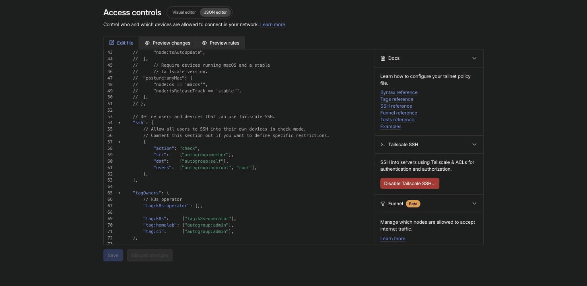
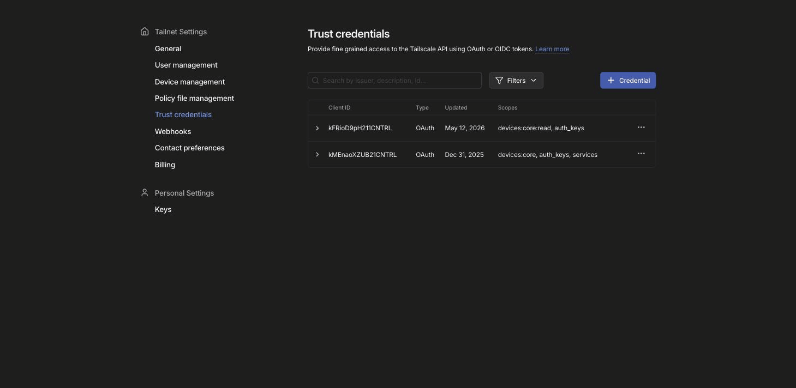
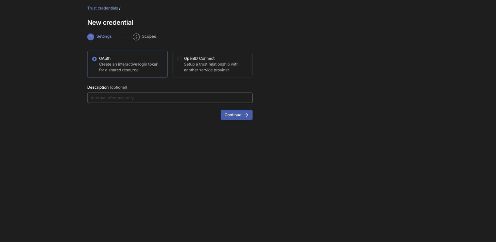

# How-To: Create a Tailscale OAuth Client for GitHub Actions CI

**Purpose**: Create a dedicated Tailscale OAuth client that allows GitHub Actions runners to join the tailnet and reach the cluster API server

**Scope**: Tailscale ACL configuration and OAuth client creation for CI/CD pipeline connectivity

**Overview**: The GitHub Actions helmfile workflows need to connect to the homelab cluster via Tailscale
    to run `helmfile diff` (on PRs) and `helmfile apply` (on merge). This requires a separate OAuth
    client from the one used by the in-cluster tailscale-operator. The CI OAuth client creates
    ephemeral Tailscale nodes tagged with `tag:ci` that are automatically cleaned up when the
    workflow completes. The `tag:ci` ACL tag restricts CI runners to only reach the K8s API server.

**Dependencies**: Tailscale admin access, Access Controls (ACL) editor access

**Exports**: OAuth Client ID and Client Secret for use as GitHub Secrets (`TS_OAUTH_CLIENT_ID`, `TS_OAUTH_CLIENT_SECRET`)

**Related**: helmfile-diff.yml, helmfile-deploy.yml, k8s/ci/README.md, .gitleaks.toml

**Implementation**: Three-step process — add `tag:ci` to ACLs, create the OAuth client, verify and store credentials

**Difficulty**: beginner

---

## Prerequisites

- Admin access to the [Tailscale admin console](https://login.tailscale.com/admin)
- The tailnet must already have the homelab cluster nodes joined

## Step 1: Add `tag:ci` to the ACL Policy

The OAuth client needs a tag to assign to CI runner devices. This tag must exist in the ACL `tagOwners` before the OAuth client can use it.

1. Navigate to [Access controls > JSON editor](https://login.tailscale.com/admin/acls/file)

2. Scroll down to find the `tagOwners` section

3. Add `"tag:ci": ["autogroup:admin"],` to the `tagOwners` block:

```jsonc
"tagOwners": {
    // k3s operator
    "tag:k8s-operator": [],
    "tag:k8s":      ["tag:k8s-operator"],
    "tag:homelab": ["autogroup:admin"],
    "tag:ci":      ["autogroup:admin"],   // <-- add this line
},
```

4. Click **Save** at the bottom of the editor

The ACL editor with `tag:ci` added to `tagOwners`:



> **Note on ACL rules**: The current tailnet uses a permissive wildcard grant (`"src": ["*"], "dst": ["*"]`) that already allows CI devices to reach the cluster. If you later tighten the grants to be restrictive, add a specific grant for CI:
> ```jsonc
> {
>     "src": ["tag:ci"],
>     "dst": ["cluster-node-1"],
>     "ip": ["*"],
> },
> ```

## Step 2: Create the OAuth Client

1. Navigate to [Settings > Trust credentials](https://login.tailscale.com/admin/settings/trust-credentials)

The trust credentials page shows existing OAuth clients and the **+ Credential** button:



2. Click the **+ Credential** button (top right)

3. **Step 1 of 2 — Settings**:

The form presents two credential types. Select OAuth and enter a description:



   - Select **OAuth** (should be selected by default)
   - Enter description: `github-actions-homelab-ci`
   - Click **Continue**

4. **Step 2 of 2 — Scopes**:

   Leave the scope dropdown as **Custom scopes**, then configure:

   - Expand the **Devices** section:
     - Check **Core** > **Read**

   - Expand the **Keys** section:
     - Check **Auth Keys** > **Write** (this auto-checks Read)

   - A **Tags** field appears below Auth Keys (required for write scope). It reads: "Auth keys generated by this OAuth Client must assign tags (or tags managed by these tags) to devices they authorize."
     - Click the **Add tags** dropdown
     - Select **tag:ci** from the list

   - Leave all other scopes unchecked (DNS, Policy File, Users, Services, etc.)

5. Click **Generate credential**

6. A **"Credential created"** modal appears with the Client ID and Client Secret. **Copy both values immediately** — the Client Secret is only shown once.

> **Do not take a screenshot of the credential modal** — it contains the Client Secret in plaintext.

## Step 3: Store the Credentials

Save the credentials to `~/credentials/homelab.env`:

```bash
# Append to your credentials file
cat >> ~/credentials/homelab.env << 'EOF'

# Tailscale OAuth for GitHub Actions CI (tag:ci)
export TS_OAUTH_CLIENT_ID="<paste Client ID here>"
export TS_OAUTH_CLIENT_SECRET="<paste Client Secret here>"
EOF
```

These are also stored as GitHub Secrets (see [k8s/ci/README.md](../../k8s/ci/README.md)):
- Client ID → `TS_OAUTH_CLIENT_ID`
- Client Secret → `TS_OAUTH_CLIENT_SECRET`

## Step 4: Verify the Credentials

Smoke test the OAuth client by requesting an access token from the Tailscale API:

```bash
source ~/credentials/homelab.env

curl -s -X POST "https://api.tailscale.com/api/v2/oauth/token" \
  -d "client_id=${TS_OAUTH_CLIENT_ID}" \
  -d "client_secret=${TS_OAUTH_CLIENT_SECRET}" \
  -d "grant_type=client_credentials" | python3 -c "
import sys, json
resp = json.load(sys.stdin)
if 'access_token' in resp:
    print(f'Valid! Got access token (expires in {resp.get(\"expires_in\", \"?\")}s)')
else:
    print(f'FAILED: {json.dumps(resp, indent=2)}')
"
```

Expected output: `Valid! Got access token (expires in 3600s)`

## Credential Protection

The `.gitleaks.toml` in this repo has custom rules that detect Tailscale credentials if accidentally committed:

- `tailscale-client-secret` rule catches `tskey-client-*` patterns
- `tailscale-client-id` rule catches `*CNTRL` patterns

These run automatically on every commit via the pre-commit hook configured in `prek.toml`.

## Scope Rationale

| Scope | Why |
|-------|-----|
| Devices > Core > Read | The `tailscale/github-action` needs to see device information when joining the tailnet |
| Keys > Auth Keys > Write | The action generates an ephemeral auth key to register the CI runner as a temporary device |
| tag:ci | Tags the CI runner device so ACL rules can scope its network access |

## What Happens at Runtime

When a GitHub Actions workflow runs:

1. The `tailscale/github-action` uses the OAuth Client ID + Secret to authenticate with the Tailscale API
2. It generates an ephemeral auth key tagged with `tag:ci`
3. It starts the Tailscale daemon on the runner and joins the tailnet using that key
4. The runner can now resolve `cluster-node-1` via Tailscale MagicDNS and reach port 6443
5. When the workflow completes, the ephemeral node is automatically removed from the tailnet

## Verification

After creating the OAuth client, verify it appears in the [Trust credentials](https://login.tailscale.com/admin/settings/trust-credentials) list:
- Confirm a second OAuth client exists with scopes `devices:core:read, auth_keys`

## Troubleshooting

**"tag not found" when selecting tags**: The tag must exist in `tagOwners` in the ACL file first. Go back to [Step 1](#step-1-add-tag-ci-to-the-acl-policy) and make sure you saved the ACL.

**CI runner can't reach the cluster**: Check that the ACL grants allow `tag:ci` to reach `cluster-node-1:6443`. Add `tailscale status` as a debug step in the CI workflow to verify the runner joined the tailnet.

**"unauthorized" errors from the smoke test**: The Client Secret may have been copied incorrectly, or the OAuth client may have been deleted/regenerated. Create a new OAuth client and update both `~/credentials/homelab.env` and the GitHub Secrets.

**Credentials detected by gitleaks**: If you accidentally staged a file containing Tailscale credentials, the pre-commit hook will block the commit. Remove the credentials from the file before committing.
