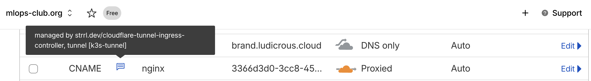

# MLOps Club Kubernetes Cluster 🐳

## Quick Start (set up cluster from scratch)

Prerequisites
1. fill out `.env.example` and rename it to `.env`
2. install tailscale and join the tailnet

```bash
cd ./k3s-ansible
./run deploy
```

Now copy the kubeconfig file

```bash
ssh -t main@cluster-node-1 "sudo cat /etc/rancher/k3s/k3s.yaml" > k3s-ansible/kubeconfig
# ^^^ prints it to the terminal, then copy and
pbpaste > ~/.kube/config
# ^^^ be sure to set server to https://cluster-node-1:6443
```

Install various operators for DNS and networking

```
cd ..
./install-helm-charts.sh
```

Try deploying some services to nginx and testing the connection

```bash
cd ./nginx-deployment
./deploy-all.sh
```

## K3s Deployment with Ansible

- [`k3s-ansible/`](./k3s-ansible/). This was taken from [this git repo](https://github.com/timothystewart6/k3s-ansible) NO modifications were made, except:
  - [./k3s-ansible/inventory/cluster/group_vars/all.yml](./k3s-ansible/inventory/cluster/group_vars/all.yml)
  - [./k3s-ansible/inventory/cluster/hosts.ini](./k3s-ansible/inventory/cluster/hosts.ini)
  - Deploy with `bash ./k3s-ansible/run deploy`.
  - Teardown with `bash ./k3s-ansible/run reset`.

Note, the `run` script uses `uv` and a `pyproject.toml` file which we added to make dependency management cleaner.

In [`all.yml`](./k3s-ansible/inventory/cluster/group_vars/all.yml), we only changed a few values from default:
- `system_timezone: America/Denver`
- `flannel_iface: enp1s0` Because the NUCs use that interface instead of `eth0`.
- `metal_lb_ip_range: 192.168.50.200-192.168.50.220` Because the NUCs are on a LAN with IPs in `192.168.50.(up to 199)` and the IPs assigned to pods by metallb must not overlap with those.


## Networking with Cloudflare/Tailscale

We managed to make both internal and external services accessible with pretty DNS names.

The [`nginx-deployment/`](./nginx-deployment/) contains manifests which show how this is done.

| Service Details | Files | K8s Operators ([install script](./install-helm-charts.sh)) |
|----------------|-----------|------------|
| • **URL:** [a tailscale IP known after deploy]<br>• **Reachable:** Internal only<br>• **DNS:** IP only<br>• **Protocol:** HTTP only<br><br>Service accessible only within the Tailscale network via an IP address. | • **Manifest:** [manifest-internal-tailscale.yaml](./nginx-deployment/manifest-internal-tailscale.yaml)<br>• **Setup Guide:** [TAILSCALE_OPERATOR_SETUP.md](./nginx-deployment/TAILSCALE_OPERATOR_SETUP.md) | • **Tailscale operator:** Tunnels traffic to services within the Tailscale network |
| • **URL:** https://nginx.mlops-club.org/<br>• **Reachable:** Public<br>• **DNS:** Pretty DNS<br>• **Protocol:** HTTPS<br><br>Service accessible via a public domain name via Cloudflare Tunnel. | • **Manifest:** [manifest-public-cloudflare.yaml](./nginx-deployment/manifest-public-cloudflare.yaml)<br>• **Setup Guide:** [CLOUDFLARE_TUNNEL_SETUP.md](./nginx-deployment/CLOUDFLARE_TUNNEL_SETUP.md) | • **Cloudflare Tunnel operator:** Creates secure tunnels from Cloudflare to internal services, enabling public HTTPS access |
| • **URL:** http://nginx-internal.mlops-club.org/<br>• **Reachable:** Internal only<br>• **DNS:** Pretty DNS<br>• **Protocol:** HTTP<br><br>Service accessible via a public domain name via Tailscale and Cloudflare Tunnel. The DNS name resolves to a Tailscale private IP address. | • **Manifest:** [manifest-internal-tailscale-cloudflare.yaml](./nginx-deployment/manifest-internal-tailscale-cloudflare.yaml)<br>• **Setup Guide:** [EXTERNAL_DNS_TAILSCALE_SETUP.md](./nginx-deployment/EXTERNAL_DNS_TAILSCALE_SETUP.md) | • **External-DNS operator:** Creates/updates A records (subdomain to IP address) in Cloudflare that resolve to Tailscale private IPs<br>• **Tailscale operator:** Tunnels traffic to the internal Tailscale IP |



## TLS/SSL with Traefik

Cloudflare can manage a single wildcard TLS cert for us.

> So we don't have to go through the pain of LetsEncrypt rate limits when we accidentally try to issue a cert more than 5 times in a day.


## Common issues

### Reaching the control plane

Set this line and make sure tailscale is enabled

```yaml
# ~/.kube/config
clusters:
  cluster:
    server: https://cluster-node-1:6443
```

### TLS errors with kubectl

```bash
$ kubectl get nodes -o wide
Error from server (BadRequest): Unable to list "/v1, Resource=nodes": the server rejected our request for an unknown reason (get nodes)
```

Cause: When `./run reset` is run, new x509 certs are generated on the cluster nodes, which means the certs in `~/.kube/config` are out of date.

Fix: run 

```bash
ssh -t main@cluster-node-1 "sudo cat /etc/rancher/k3s/k3s.yaml" > k3s-ansible/kubeconfig
```

then copy the resulting kubeconfig to the clipboard, and paste it to the right location with `pbpaste > ~/.kube/config`.

## Appendix: Traefik HTTPS Configuration Comparison

When using Traefik for HTTPS termination, services can be exposed either internally (via Tailscale) or externally (via Cloudflare Tunnel). The following table compares the key differences:

| Aspect | Internal HTTPS (private) | External HTTPS (public) |
|--------|--------------------------|-------------------------|
| **Ingress Class** | `traefik-private` | `traefik-pub` |
| **TLS Secret** | `priv-wildcard-tls` (wildcard `*.priv.mlops-club.org`) | `cloudflare-origin-cert` (or ACME) |
| **External-DNS Annotation** | ✅ Required (points to Traefik's Tailscale IP) | ❌ Not needed |
| **Traefik Exposure** | Via Tailscale LoadBalancer | Via Cloudflare Tunnel Ingress |
| **DNS Management** | External-DNS creates A record | Cloudflare Tunnel creates DNS |
| **Access** | Tailscale network only | Public internet |

Both configurations use the same Traefik Ingress class and TLS configuration. The key difference is how Traefik itself is exposed (Tailscale LoadBalancer vs Cloudflare Tunnel) and how DNS records are managed.