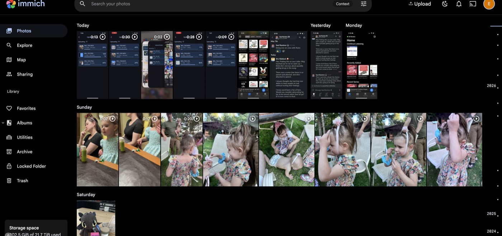
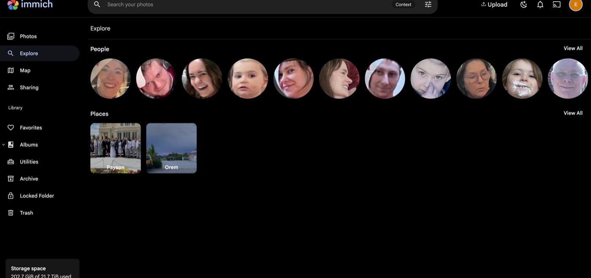
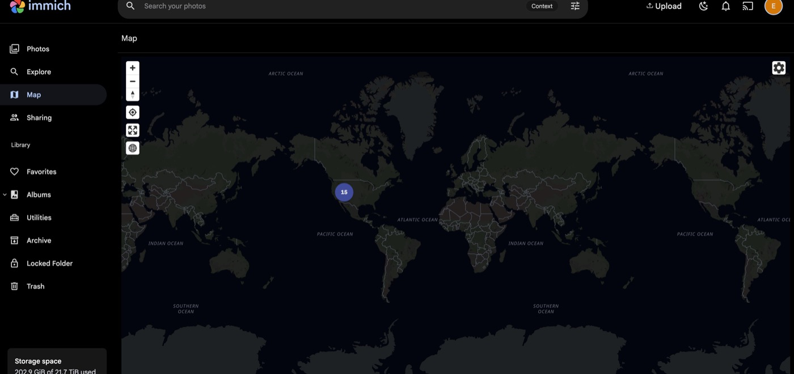
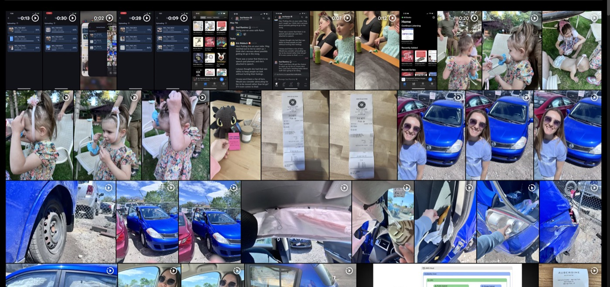

# Immich — Self-Hosted Photo & Video Management

**Purpose**: Deployment documentation for Immich on the K3s homelab cluster

**Scope**: Architecture, storage decisions, deployment, mobile app setup, and photo import

**Overview**: Immich is a self-hosted Google Photos replacement providing a web UI and native
    mobile apps with face recognition, smart search, video transcoding, and auto-upload.
    Accessible privately via Tailscale at immich.priv.mlops-club.org and photos.priv.mlops-club.org.

---

<p align="center">
  
</p>

<h3 align="center">
  Self-hosted Google Photos replacement for the MLOps Club homelab
</h3>

<p align="center">
  <a href="https://immich.priv.mlops-club.org">immich.priv.mlops-club.org</a>
  &nbsp;&bull;&nbsp;
  <a href="https://photos.priv.mlops-club.org">photos.priv.mlops-club.org</a>
  &nbsp;&bull;&nbsp;
  Private via Tailscale VPN
</p>

---

## Timeline

The main view is a chronological photo timeline with a year scrubber on the right edge.
The sidebar provides navigation to all features. Storage usage and server version are shown
at the bottom left.

<p align="center">
  
</p>

---

## Explore — Face Recognition & Places

Immich automatically detects faces and clusters them by person. It also groups photos by
location using reverse geocoding of GPS metadata.

<p align="center">
  
</p>

---

## Map View

Photos with GPS metadata are plotted on an interactive world map. Clusters expand as you
zoom in to reveal individual photos.

<p align="center">
  
</p>

---

## Smart Search

CLIP-powered natural-language search. Type a description like "outdoors" or "birthday cake"
and Immich finds matching photos using semantic understanding, not just filename or tags.

<p align="center">
  
</p>

---

## Access

| URL | Network | Purpose |
|-----|---------|---------|
| `https://immich.priv.mlops-club.org` | Tailscale VPN | Primary access |
| `https://photos.priv.mlops-club.org` | Tailscale VPN | Friendly alias |

On first visit, create an admin account through the web UI.

---

## Architecture

Immich runs as 4 microservices in the `immich` Kubernetes namespace:

```
┌─────────────────────────────────────────────────────────────────────┐
│                         immich namespace                            │
│                                                                     │
│  ┌─────────────────┐    ┌──────────────┐    ┌────────────────────┐ │
│  │  immich-server   │───▶│ immich-valkey │    │  immich-machine-  │ │
│  │  (API + Web UI   │    │ (job queue)  │    │  learning          │ │
│  │   + async jobs)  │    │ port 6379    │    │  (CLIP, faces,     │ │
│  │  port 2283       │    └──────────────┘    │   object detect)   │ │
│  └────────┬─────────┘                        │  port 3003         │ │
│           │                                  └────────────────────┘ │
│  ┌────────▼─────────┐                                               │
│  │ immich-postgres   │                                               │
│  │ (+ VectorChord)   │    VectorChord enables CLIP vector search    │
│  │ port 5432         │    for smart natural-language queries         │
│  └──────────────────┘                                               │
└─────────────────────────────────────────────────────────────────────┘
```

### Component Details

| Component | Image | Role |
|-----------|-------|------|
| **immich-server** | `ghcr.io/immich-app/immich-server:release` | NestJS API server, web UI, and async job runner (thumbnails, transcoding) |
| **immich-machine-learning** | `ghcr.io/immich-app/immich-machine-learning:release` | Python/FastAPI service for face detection, CLIP embeddings, object recognition |
| **immich-postgres** | `ghcr.io/immich-app/postgres:14-vectorchord0.4.3-pgvectors0.2.0` | PostgreSQL with VectorChord extension for vector similarity search |
| **immich-valkey** | `valkey/valkey:8-alpine` | Redis-compatible BullMQ job queue |

### Networking Path

```
Mobile App / Browser
        │
        ▼
   Tailscale VPN
        │
        ▼
External-DNS (Cloudflare)  ──▶  immich.priv.mlops-club.org  }  DNS records
                           ──▶  photos.priv.mlops-club.org  }  → Traefik IP
        │
        ▼
Traefik Private (traefik-private namespace)
  - TLS via priv-wildcard-tls certificate
  - Routes to immich-server:2283
        │
        ▼
immich-server (immich namespace)
```

---

## Storage

```
UGOS NAS (100.117.142.58)
└── /volume1/k8s-homelab/
    └── media/
        └── photos/                  ◀── NFS PV (500Gi, ReadWriteMany)
            ├── upload/                  Immich-managed uploads
            ├── library/                 Organized photo library
            ├── thumbs/                  Generated thumbnails
            └── encoded-video/           Transcoded video files

K3s Node (local NVMe/SSD via local-path-provisioner)
├── postgres-data (20Gi)             ◀── PostgreSQL database
└── ml-cache (10Gi)                  ◀── Downloaded ML models (~1.5GB)
```

### Why This Split?

| Volume | StorageClass | Rationale |
|--------|-------------|-----------|
| Photo/video library | **NFS** (static PV on NAS) | Large media files need expandable shared storage on the NAS |
| PostgreSQL data | **local-path** (node SSD) | PostgreSQL requires POSIX file locking. **NFS will corrupt the database.** |
| ML model cache | **local-path** (node SSD) | Performance; models auto-redownload if lost |

> **WARNING**: Never move PostgreSQL to NFS storage. NFS does not support the POSIX file
> locking that PostgreSQL requires, and data corruption will occur silently.

---

## Deployment

### Deploy

```bash
./apps/immich/deploy.sh
```

The deploy script:
1. Creates `/volume1/k8s-homelab/media/photos` on the NAS via a temporary K8s Job
2. Applies `manifest.yaml` which creates all resources in the `immich` namespace

### Verify

```bash
# All 4 pods should be Running
kubectl get pods -n immich

# All PVCs should be Bound
kubectl get pvc -n immich

# Both ingresses should have an ADDRESS
kubectl get ingress -n immich

# Server logs should show "Nest application successfully started"
kubectl logs -l app=immich-server -n immich --tail=20

# HTTP 200 from both hostnames
curl -sk -o /dev/null -w '%{http_code}' https://immich.priv.mlops-club.org
curl -sk -o /dev/null -w '%{http_code}' https://photos.priv.mlops-club.org
```

### Files

```
apps/immich/
├── manifest.yaml          # All K8s resources (namespace, PVs, PVCs, deployments, services, ingresses)
├── deploy.sh              # Creates NAS dirs + applies manifest
└── docs/
    ├── README.md           # This file
    └── images/             # Screenshots from the live instance
```

---

## Mobile App Setup

### iOS

1. Install **Immich** from the App Store
2. Connect to **Tailscale VPN** on your device
3. Open Immich and enter server URL: `https://immich.priv.mlops-club.org`
4. Log in with your Immich credentials
5. Enable auto-upload:
   - Go to **Settings > Backup**
   - Enable **Foreground Backup** (uploads when app is open)
   - Enable **Background Backup** (periodic uploads in background)
   - Ensure **Background App Refresh** is enabled in iOS Settings > Immich

### Android

1. Install **Immich** from Google Play or F-Droid
2. Connect to **Tailscale VPN**
3. Open Immich and enter server URL: `https://immich.priv.mlops-club.org`
4. Log in with your Immich credentials
5. Enable auto-upload in **Settings > Backup**
6. Disable battery optimization for Immich (Settings > Apps > Immich > Battery > Unrestricted)

---

## Importing Existing Photos

### Web UI

Drag and drop files or folders directly into the Immich web UI.

### immich-go CLI (bulk import / Google Photos Takeout)

```bash
# Install
go install github.com/simulot/immich-go@latest

# Import from a local directory
immich-go -server https://immich.priv.mlops-club.org \
  -key YOUR_API_KEY upload /path/to/photos

# Import a Google Photos Takeout archive
immich-go -server https://immich.priv.mlops-club.org \
  -key YOUR_API_KEY upload -google-photos /path/to/Takeout
```

Get your API key from the Immich web UI: **User Settings > API Keys > New API Key**.

---

## Troubleshooting

### Video playback stops after ~60 seconds

Traefik's default response timeout is 60s. If video streaming cuts out, add a Traefik
middleware to increase timeouts:

```yaml
apiVersion: traefik.io/v1alpha1
kind: Middleware
metadata:
  name: immich-timeout
  namespace: immich
spec:
  buffering:
    responseForwarding:
      flushInterval: 100ms
```

### PostgreSQL won't start

Verify the PVC uses `local-path` storage, not NFS:

```bash
kubectl get pvc postgres-data -n immich -o jsonpath='{.spec.storageClassName}'
# Expected output: local-path
```

### ML container OOM (Out of Memory)

The ML container loads models into RAM (~1.5GB). If the node has limited RAM, reduce the
model size in Immich admin settings or increase resource limits in the manifest.

### Pods stuck in Pending

Check if PVCs are bound and nodes have sufficient resources:

```bash
kubectl get pvc -n immich
kubectl describe pod <pod-name> -n immich
```

---

## Useful Links

| Resource | URL |
|----------|-----|
| Immich Documentation | [immich.app/docs](https://immich.app/docs) |
| Immich GitHub | [github.com/immich-app/immich](https://github.com/immich-app/immich) |
| Immich Mobile (iOS) | App Store: search "Immich" |
| Immich Mobile (Android) | Google Play / F-Droid: search "Immich" |
| immich-go CLI | [github.com/simulot/immich-go](https://github.com/simulot/immich-go) |
| Awesome Immich | [awesome.immich.app](https://awesome.immich.app) |
