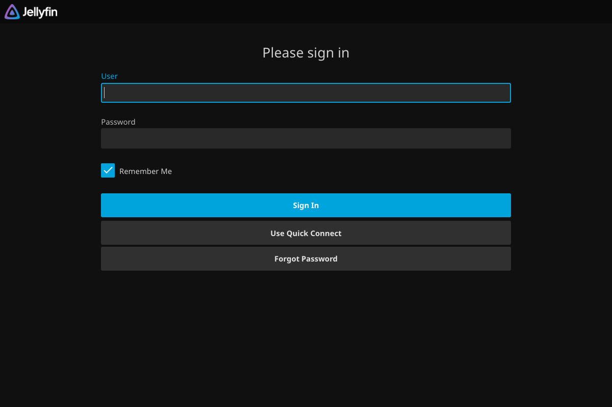

# Connecting to Jellyfin

<p align="center">
  
</p>

<p align="center">
  <em>Self-hosted media streaming for workout videos — private access via Tailscale</em>
</p>

---

Jellyfin is deployed on the homelab cluster as a private media server for streaming workout videos
(P90X, Insanity, stretching routines). It is accessible in two ways:

| Method | URL / Address | When to Use |
|--------|--------------|-------------|
| **Tailscale (remote)** | `https://jellyfin.priv.mlops-club.org` | From anywhere on the tailnet |
| **NodePort (local LAN)** | `http://<node-ip>:30096` | From devices on the home network |

---

## Option 1: Connect via Tailscale (Recommended)

Tailscale provides secure access from anywhere — home, work, or mobile.

### Prerequisites

- [Tailscale](https://tailscale.com/download) installed on your device
- Your device is joined to the MLOps Club tailnet

### Steps

1. Ensure Tailscale is connected (green icon in the system tray / menu bar)
2. Open a browser and navigate to:

   ```
   https://jellyfin.priv.mlops-club.org
   ```

3. You will see the Jellyfin login page:

   

4. Sign in with your Jellyfin credentials

> **First-time setup:** If no accounts exist, Jellyfin shows a setup wizard.
> Create an admin account and add the `/media` library (type: **Movies** or **Mixed**).

---

## Option 2: Connect via NodePort (Local Network)

For devices on the same LAN as the cluster (192.168.50.x subnet), you can connect
directly via NodePort without Tailscale.

### Steps

1. Open a browser and navigate to any cluster node on port `30096`:

   | Node | Address |
   |------|---------|
   | cluster-node-1 | `http://192.168.50.96:30096` |
   | cluster-node-2 | `http://192.168.50.226:30096` |
   | cluster-node-3 | `http://192.168.50.94:30096` |

2. Sign in with your Jellyfin credentials

> **Note:** NodePort access is HTTP only (no TLS). Use Tailscale for encrypted connections.

---

## Mobile Apps (Offline Viewing)

<p align="center">
  
</p>

Jellyfin has native apps that support **offline downloads** — download workout videos
to your phone and play them without a network connection.

### iOS

| App | Price | Offline Downloads | Notes |
|-----|-------|-------------------|-------|
| **Swiftfin** | Free | Yes | Official Jellyfin client for iOS/tvOS |
| **Streamyfin** | Free | Yes | Feature-rich third-party client |

**To connect from an iOS app:**

1. Install **Swiftfin** from the [App Store](https://apps.apple.com/us/app/swiftfin/id1604098728)
2. Tap **Connect to Server**
3. Enter the server URL:
   - Via Tailscale: `https://jellyfin.priv.mlops-club.org`
   - Via LAN: `http://192.168.50.96:30096`
4. Sign in with your Jellyfin credentials
5. Browse your library and tap the **download** icon on any video for offline viewing

### Android

| App | Price | Offline Downloads | Notes |
|-----|-------|-------------------|-------|
| **Findroid** | Free | Yes | Material You design, smooth experience |
| **Jellyfin for Android** | Free | Basic | Official Android client |

**To connect from an Android app:**

1. Install **Findroid** from [Google Play](https://play.google.com/store/apps/details?id=dev.jdtech.jellyfin)
2. Enter the server URL (same as iOS, above)
3. Sign in and download videos for offline use

---

## Adding Videos to the Library

Videos are stored on the NAS at `/volume1/k8s-homelab/media/videos/`. Organize them
in folders for clean library browsing:

```
/volume1/k8s-homelab/media/videos/
  P90X/
    01 - Chest & Back.mkv
    02 - Plyometrics.mkv
    ...
  Insanity/
    01 - Dig Deeper.mkv
    02 - Plyometric Cardio Circuit.mkv
    ...
  Stretching/
    Morning Stretch.mkv
    Yoga for Recovery.mkv
    ...
```

After adding files to the NAS, trigger a library scan in Jellyfin:
**Dashboard** > **Libraries** > **Scan All Libraries**

---

## Recommended Plugins

Install these from **Dashboard** > **Plugins** > **Catalog**:

| Plugin | What It Does |
|--------|-------------|
| **Intro Skipper** | Auto-detects and skips repetitive workout video intros via audio fingerprinting |
| **Chapter Images** | Generates seek-bar thumbnails for chapter markers — jump to specific exercises |

---

## Troubleshooting

### "Unable to connect to server"

- **Tailscale**: Verify Tailscale is connected (`tailscale status`)
- **LAN**: Verify your device is on the `192.168.50.x` subnet
- **Pod health**: `kubectl get pods -n jellyfin` — pod should show `1/1 Running`

### Video buffering or stuttering

Jellyfin uses software transcoding by default. If playback is slow:

1. Try setting the client to **Direct Play** (avoids transcoding entirely)
2. In the web UI: **User Settings** > **Playback** > **Preferred media player** > set **Maximum streaming bitrate** to a high value
3. Ensure the video format is natively supported by your client (MP4/H.264 is widely compatible)

### Library not showing videos

1. Verify files exist on the NAS: `ls /volume1/k8s-homelab/media/videos/`
2. In Jellyfin: **Dashboard** > **Libraries** > **Scan All Libraries**
3. Check that the library is pointed at `/media` (the mount path inside the container)
