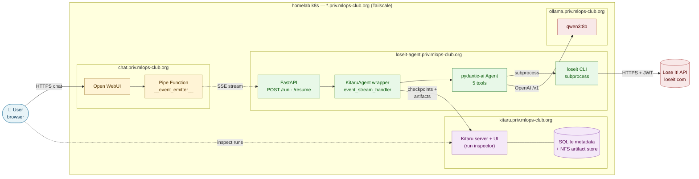
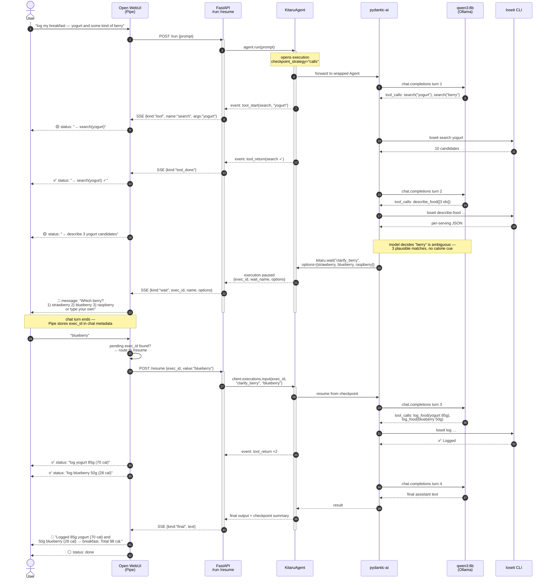

# loseit-agent — architecture & sequence

End state: Open WebUI on the homelab triggers a Kitaru-wrapped pydantic-ai agent that drives the `loseit` CLI. Live tool-call statuses stream back into the chat; the agent can pause for user disambiguation and resume cleanly.

## Architecture

The Pipe lives inside the Open WebUI pod (uploaded via the admin UI; source-of-truth is `apps/loseit-agent/pipe/openwebui_pipe.py`). FastAPI + KitaruAgent + pydantic-ai + the loseit CLI are all in the agent pod. Kitaru's server + UI is a separate pod so it persists across agent restarts. All same-tailnet, all `traefik-private` ingress, all `priv-wildcard-tls`.

## Sequence — prompt → agent run → status updates → ambiguity → resume → final

## Key design points

- **Status emission path** = `event_stream_handler` on `KitaruAgent` → asyncio queue → SSE chunk → Open WebUI `__event_emitter__({"type":"status"})`. One pipeline, no polling.
- **Ambiguity = `kitaru.wait(name, options=…)`.** Kitaru natively pauses the execution at a checkpoint; the SSE stream emits a `wait` event, the Pipe ends its current response, and the chat turn closes.
- **Resume = same `exec_id`.** Open WebUI stores the `exec_id` in chat metadata; the user's next message goes to `POST /resume` instead of `/run`. `client.executions.input(exec_id, name, value)` unblocks the checkpoint and the run continues from where it paused (no token replay).
- **Multi-choice vs free text** are handled identically — both arrive as the user's next chat message. The Pipe just sends whatever string it receives to `/resume`. If you want strict multi-choice, validate the value server-side and re-prompt if invalid.
