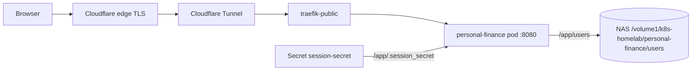

# personal-finance

**Purpose**: Deploy and operate the personal-finance FIRE planner on the homelab cluster

**Scope**: `apps/personal-finance/` — image build, deployment, first-time data seeding, upgrades,
    user management, and backups

**Overview**: The FIRE planner ([phitoduck/personal-finance](https://github.com/phitoduck/personal-finance))
    is a FastAPI server plus a single-page HTML app, served at https://personal-finance.mlops-club.org
    through Cloudflare Tunnel and `traefik-public`. Each user's plan and salted password hash is one
    JSON file in `users/`, stored on the NAS at `/volume1/k8s-homelab/personal-finance/users`. The
    container image is built from the app repo and pushed to Harbor, the same pattern as
    come-follow-me-app and seminary-feedback.

**Dependencies**: Harbor (`cr.priv.mlops-club.org`), NFS CSI driver and NAS, `traefik-public`,
    Cloudflare Tunnel catch-all ingress

**Exports**: `personal-finance` namespace, https://personal-finance.mlops-club.org

**Related**: `manifest.yaml`, `deploy.sh`, `init-nas.yaml`, `.ai/howto/how-to-deploy-a-new-app.md`

---

## Architecture



| Piece | Location | Notes |
|-------|----------|-------|
| Code, Dockerfile, `version.txt` | `phitoduck/personal-finance` | `version.txt` is the image tag |
| Image | `cr.priv.mlops-club.org/personal-finance/app` | pushed with `just build-push-harbor` |
| Plans + password hashes | NAS `/volume1/k8s-homelab/personal-finance/users` | static PV, `Retain` reclaim policy |
| Session-signing key | Secret `session-secret` | generated once by `deploy.sh`, kept on re-runs |

The image contains no `users/` directory. The NAS copy is the only live copy of each plan; `users/`
in the app repo is local-development data.

## Deploy

1. Create the private Harbor project `personal-finance` at https://cr.priv.mlops-club.org (one time).
2. In the personal-finance repo, build and push the image (needs Docker and `HARBOR_PASSWORD`):

   ```bash
   just build-push-harbor
   ```

3. Set `PERSONAL_FINANCE_APP_VERSION` in `.env` to the value in `version.txt` (see `env.example`).
4. Deploy:

   ```bash
   ./apps/personal-finance/deploy.sh
   ```

5. Verify:

   ```bash
   kubectl get pods,pvc -n personal-finance
   curl -s https://personal-finance.mlops-club.org/api/users
   ```

## Seed Existing Users (First Deploy)

The NAS directory starts empty. Copy each user's file from the app repo into the running pod:

```bash
POD=$(kubectl get pod -n personal-finance -l app=personal-finance -o jsonpath='{.items[0].metadata.name}')
kubectl cp users/eric.json "personal-finance/${POD}:/app/users/eric.json"
```

## Upgrade

1. Bump `version.txt` in the app repo and run `just build-push-harbor`.
2. Bump `PERSONAL_FINANCE_APP_VERSION` in `env.example` and `.env`.
3. Run `./apps/personal-finance/deploy.sh`.

## Manage Users

New profiles are created from the sign-in screen. To reset a password, run the app's CLI inside the
pod; it keeps the user's plan:

```bash
kubectl exec -it -n personal-finance deploy/personal-finance -- python app.py passwd <name>
```

## Back Up

The data is plain JSON on the NAS; include `/volume1/k8s-homelab/personal-finance` in NAS backups.
For an ad-hoc copy:

```bash
kubectl cp "personal-finance/${POD}:/app/users" ./personal-finance-users-backup
```

## Security Notes

- The site is on the public internet. The app handles sign-in: PBKDF2 password hashes and a signed,
  `HttpOnly`, `SameSite=Strict` session cookie.
- Anyone who reaches the site can list profile names (`GET /api/users`) and create a new profile
  (`POST /api/users`), which writes a small file to the NAS.
- To restrict access to known people, add a Cloudflare Access application for
  `personal-finance.mlops-club.org` (email one-time PIN, allow-listed addresses). No cluster change
  is needed.
