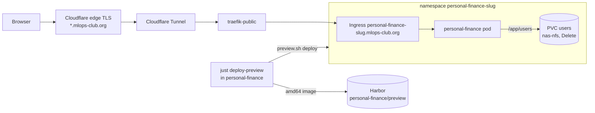

# personal-finance previews

**Purpose**: Run feature branches of the personal-finance FIRE planner on their own public subdomains

**Scope**: `apps/personal-finance/preview/` — per-branch namespaces, their storage and images, and the
    script that creates, lists, and deletes them

**Overview**: A preview runs one branch of [phitoduck/personal-finance](https://github.com/phitoduck/personal-finance)
    at `https://personal-finance-<slug>.mlops-club.org`, so a change can be tried on the real cluster before it
    merges. `<slug>` is the branch name made URL-safe. Each preview is a separate namespace with an empty
    NAS-backed `users/` directory and its own session key, so it never sees production plans or sign-ins.
    No DNS or tunnel change is needed: the Cloudflare Tunnel catch-all already sends every `*.mlops-club.org`
    host to `traefik-public`, which routes on the preview's Ingress.

**Dependencies**: Harbor (`cr.priv.mlops-club.org`), the `nas-nfs` StorageClass, `traefik-public`, the
    Cloudflare Tunnel catch-all ingress, a `.env` with `HARBOR_ADMIN_PASSWORD`

**Exports**: `personal-finance-<slug>` namespaces labelled `app.kubernetes.io/part-of=personal-finance-preview`,
    images `cr.priv.mlops-club.org/personal-finance/preview:<slug>-<commit>`

**Related**: `manifest.yaml`, `preview.sh`, `../README.md` (production), `network/public/README.md`

---

## Architecture



## Naming

| Branch | Slug | URL |
|--------|------|-----|
| `tax-projection` | `tax-projection` | `https://personal-finance-tax-projection.mlops-club.org` |
| `feature/Tax_Projection` | `feature-tax-projection` | `https://personal-finance-feature-tax-projection.mlops-club.org` |

The branch is lowercased and each run of characters other than `a-z0-9` becomes one `-`, trimmed at both ends.
The host is a single DNS label, because Cloudflare's free Universal SSL covers only one level of
`*.mlops-club.org`, and a label holds at most 63 characters. A longer name is cut and ends in the first six hex
digits of the SHA-1 of the full branch name, so two long branches never share a preview.
`preview.sh slug <branch>` and `preview.sh url <branch>` print both.

## Usage

From the personal-finance repo, on the feature branch with everything committed:

```bash
just deploy-preview   # build, push, and roll out this branch; prints the URL
just list-previews    # branch and URL of every preview
just delete-preview   # remove this branch's preview (or: just delete-preview <branch>)
```

Those recipes call `preview.sh` here, which also works on its own with an image already in Harbor:

```bash
./apps/personal-finance/preview/preview.sh deploy <branch> cr.priv.mlops-club.org/personal-finance/preview:<tag>
./apps/personal-finance/preview/preview.sh delete <branch>
./apps/personal-finance/preview/preview.sh list
```

`deploy` is idempotent: it creates the namespace, the `harbor-creds` pull secret and (once) the session key,
applies `manifest.yaml`, waits for the rollout, and waits for `/api/users` to answer on the public URL.
`delete` deletes the namespace, which deletes the preview's NAS volume, and then the branch's images in Harbor.

## Security Notes

- A preview is on the public internet, like production, and has the same sign-in. Don't put real plans in it.
- Each preview has its own `session-secret`, so a session cookie from production or another preview is rejected.
- Previews mount only their own dynamically provisioned volume, never production's `users/` directory.
