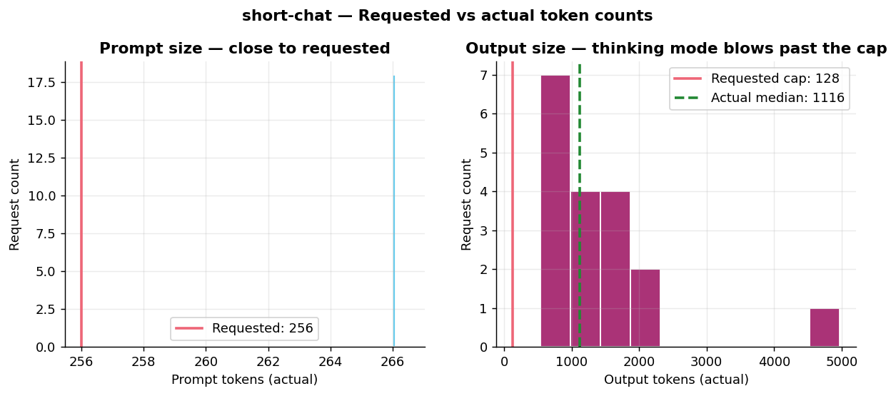
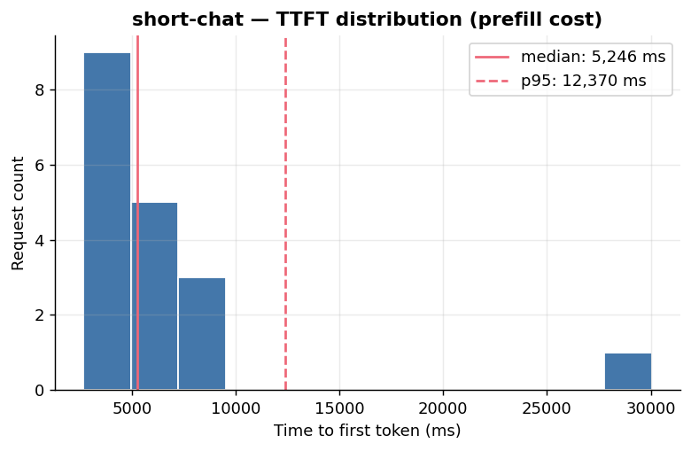
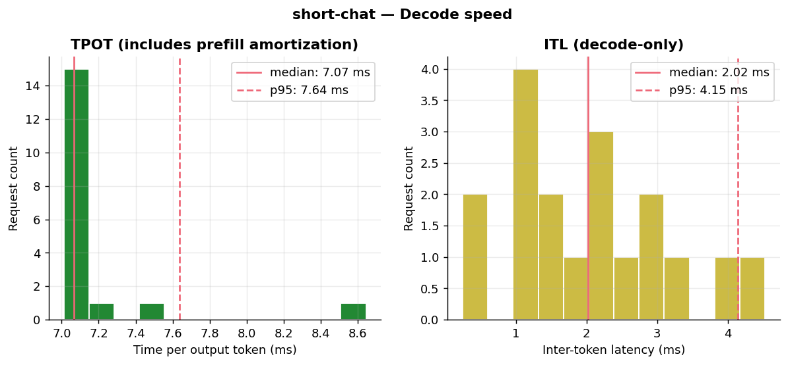
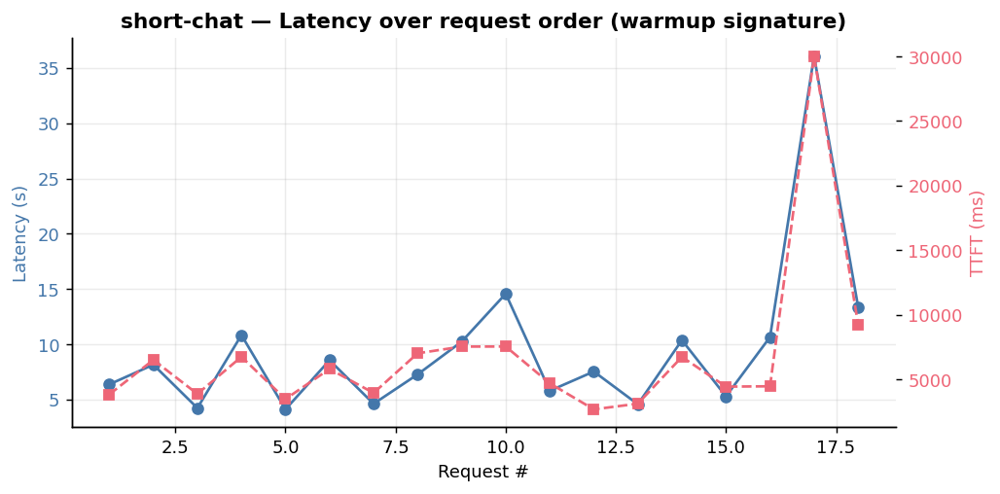
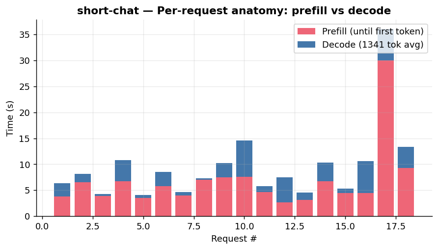
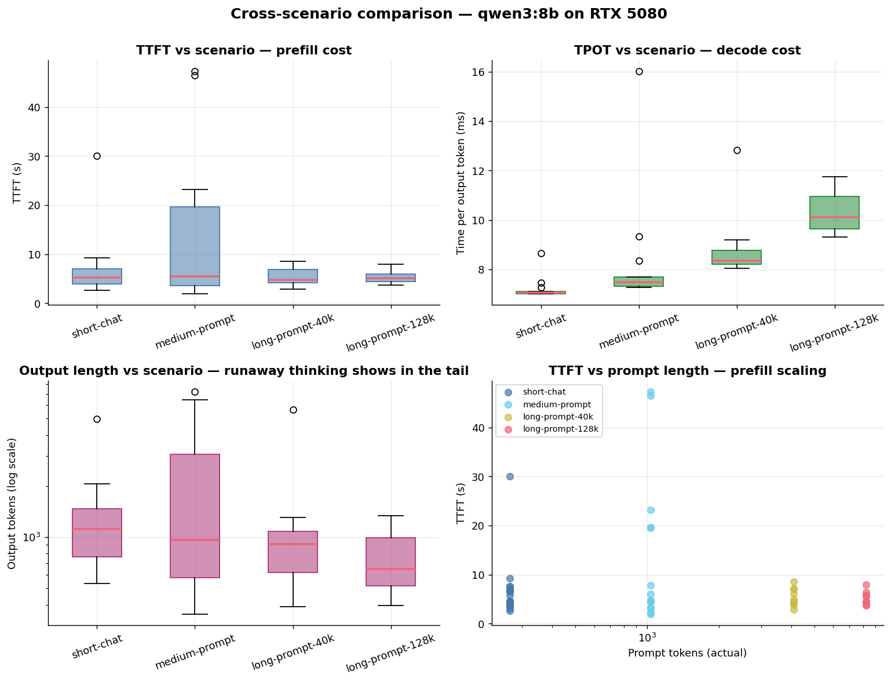

# How we benchmark this homelab's LLM serving stack

A guided tour through:
1. **What GuideLLM is**, and how it generates load
2. **The choices baked into this homelab's benchmark suite** — and why
3. **Deep dive on the `short-chat` scenario** — what each metric means, what its distribution looks like
4. **Cross-scenario comparison** — what the four scenarios together tell us about this serving stack

All figures in this document are generated from real benchmark JSON output by `benchmarks/guidellm/plot.py` (a [PEP 723](https://peps.python.org/pep-0723/) UV-managed script).

---

## 1. What GuideLLM does

GuideLLM is a load generator built specifically for streaming LLM inference servers. From the client's point of view it's just an HTTP load tool — but it captures metrics that generic tools (`hey`, `wrk`, `vegeta`) can't, because LLM responses don't have a single latency; they have *two* latencies that matter independently:

```
┌──────────────────────────────────────────────────────────┐
│  POST /v1/chat/completions                               │
│  ──────────►                                             │
│           ←── token1 ←── token2 ←── token3 ←── ... ←──   │
│                                                          │
│  ├──TTFT──┤├─ITL─┤├─ITL─┤                                │
│  ├──── time-per-output-token (TPOT) averaged ──────┤     │
│  ├────────── end-to-end request latency ───────────┤     │
└──────────────────────────────────────────────────────────┘
```

| Metric | What it measures | What it tells you |
|---|---|---|
| **TTFT** | Wall time from request send to *first* token received | Prefill cost. Dominates short-output tasks: classification, routing, "is this spam?" |
| **TPOT** | End-to-end latency divided by output tokens | Effective per-token cost — what your user feels |
| **ITL** | Median gap between consecutive token chunks | Pure decode speed, ignoring the prefill spike |
| **Output tokens/sec** | Streaming token rate | Throughput from the user's POV |
| **Request latency** | Total end-to-end seconds | What you'd see in an APM dashboard |

GuideLLM also captures *requested* vs *actual* token counts, which turns out to be load-bearing for benchmarking reasoning models — see §3.

### The request lifecycle GuideLLM models

```
                  ┌─────────────────────────────┐
                  │   1. Generate synthetic     │
                  │      prompt (target tokens) │
                  └────────────┬────────────────┘
                               │
                  ┌────────────▼────────────────┐
                  │   2. Send chat completion   │
                  │      (stream=true)          │
                  └────────────┬────────────────┘
                               │
              ┌────────────────┴────────────────┐
              ▼                                 ▼
   ┌──────────────────┐              ┌─────────────────────┐
   │  3a. Token chunk │              │  3b. Token chunk    │  ... etc
   │      received    │   →repeat→   │      received       │
   │  Record arrival  │              │  Record arrival     │
   │  time            │              │  time               │
   └──────────────────┘              └─────────────────────┘
                               │
                  ┌────────────▼────────────────┐
                  │  4. Stream done             │
                  │     Compute TTFT, ITL, TPOT │
                  └─────────────────────────────┘
```

### Load profiles GuideLLM supports

| Profile | What it does | When you'd use it |
|---|---|---|
| `synchronous` | One request at a time, next starts after the previous finishes | Single-user latency floor. What we use here. |
| `concurrent` | N requests in flight simultaneously | Capacity test against vLLM with continuous batching. **Not useful for Ollama** with `NUM_PARALLEL=1` — requests queue. |
| `constant` | Fixed requests-per-second | Service-level objective check at a known rate. |
| `poisson` | RPS jittered around a target | Like `constant` but more realistic arrival pattern. |
| `throughput` | Saturate the server | Find max RPS before latency degrades. |
| `sweep` | Auto-explore multiple rates and find the knee | The "give me a curve" mode. |

---

## 2. The choices baked into this suite

### Why synchronous?

The Ollama deploy in this homelab is configured with `OLLAMA_NUM_PARALLEL=1`. That's not a benchmark choice — it's a VRAM choice. A single 16 GB RTX 5080 cannot comfortably fit two concurrent 128K-context KV caches; the second one OOMs. Forcing `NUM_PARALLEL=1` makes Ollama serialize. From a benchmark perspective this means: **any concurrent or throughput profile would just measure how fast Ollama can queue requests**, not how fast it can serve them. The only meaningful question for this setup is the single-stream latency profile.

### Why these four scenarios

```
┌─────────────────────────────────────────────────────────────────────┐
│                                                                     │
│  short-chat        prompt=  256 tok   output=128 tok    n=20        │
│  (typical Q&A turn)                                                 │
│                                                                     │
│  medium-prompt     prompt= 1024 tok   output=256 tok    n=15        │
│  (long answer over a paragraph of context)                          │
│                                                                     │
│  long-prompt-40k   prompt= 4096 tok   output=256 tok    n=10        │
│  (large RAG context, still within 40K model limit)                  │
│                                                                     │
│  long-prompt-128k  prompt= 8192 tok   output=256 tok    n= 8        │
│  (uses qwen3:8b-128k derived model — needs the 128K context)        │
│                                                                     │
└─────────────────────────────────────────────────────────────────────┘
```

The progression isolates **prefill cost** (which scales roughly linearly with prompt length) from **decode cost** (which is per-output-token). When we plot TTFT vs prompt length across these four scenarios, we expect a clear upward slope; when we plot TPOT, we expect it to stay roughly flat.

### Why benchmark *both* model variants

Recall the gotcha from PR #21: the upstream `qwen3:8b` Modelfile hard-codes `num_ctx=40960`. We pull both:
- `qwen3:8b` (40K, what the registry ships)
- `qwen3:8b-128k` (derived via `FROM qwen3:8b\nPARAMETER num_ctx 131072`)

Same weights on disk, different load-time KV cache allocation. The `long-prompt-128k` scenario is the only one that *requires* the 128K variant — and the only one where we'd see whether the bigger KV cache exacts a TTFT penalty on smaller prompts.

### The thinking-mode tax (the elephant)

Qwen3 ships with reasoning mode on. Every response starts with a `<think>...</think>` block before the actual answer. **The result is that GuideLLM's `output_tokens=128` cap is ignored** — the model generates as many thinking tokens as it wants, then the answer, often summing to ~1000+ tokens.

Implications for the benchmark:
- Raw **end-to-end latency** numbers are dominated by output length, not model speed.
- **TPOT and ITL** stay informative — they're per-token rates that don't care about output count.
- **Output token distributions** become a useful diagnostic in their own right.

We left thinking on because it's the default Qwen3 user experience. The report will note where this affects interpretation; if you want a "thinking off" baseline, the easiest move is a second pass with a `/no_think` system prompt.

---

## 3. Deep dive: short-chat (20 requests, qwen3:8b, sync)

The single-scenario plots below introduce each metric on the simplest scenario before §4 compares all four side-by-side.

### 3.1 Token counts — the thinking-mode tax, visualized



Reading this plot:
- **Left**: prompt tokens cluster at 266 — close to the requested 256 (GuideLLM's synthetic prompts wobble within a tolerance band).
- **Right**: output tokens are **all over the place**, median **1116 tokens**, against a requested cap of **128**. One request emitted ~4800 tokens. The red line at 128 is essentially never honored.

This is the single biggest factor distorting our latency numbers. Don't compare `short-chat` end-to-end latency to a non-reasoning model's `short-chat` numbers without normalizing.

### 3.2 TTFT — the prefill cost



For a 256-token prompt on this 16 GB GPU running qwen3:8b at Q4_K_M:
- **Median TTFT: 5.2 s**. That's *high*. For a chat UX, anything over ~500 ms feels laggy.
- **p95: 12.4 s**. One request took ~30 s before the first token streamed.

The high TTFT is *not* pure prefill — it includes Ollama's request-queuing latency, the initial model-loading hit on the very first request (cold cache), and any HTTP roundtrip overhead. The outlier at ~30 s is almost certainly a thinking-pause: the model started generating thinking tokens but didn't flush a streaming chunk for several seconds because Ollama batches small streams.

### 3.3 Decode speed — TPOT and ITL



This is where the GPU shines:
- **TPOT median 7.07 ms** → ~**141 output tokens/sec** end-to-end (includes amortized prefill).
- **ITL median 2.02 ms** → ~**495 tokens/sec** during pure decode bursts.

The ~3.5× gap between ITL and TPOT is the prefill cost spread across the output: `prefill_s / output_tokens ≈ 5 / 1100 = 4.5 ms/token of overhead`. Add that to 2 ms ITL and you get 6.5 ms — matches the observed TPOT closely.

**Interpretation**: the RTX 5080 can drive qwen3:8b at ~500 tok/s during steady-state decode. The user-visible rate (~141 tok/s) is held down by the (a) prefill spike and (b) Ollama's streaming chunking (`iter_tokens_per_iteration ≈ 2.45` — chunks are released every ~2.5 tokens, not every token).

### 3.4 Latency over time — warmup signature and outliers



Reading this:
- Requests 1-16 hover in a stable 4-15 s band — no obvious "first request is slow" warmup curve, because `OLLAMA_KEEP_ALIVE=24h` kept the model resident.
- **Request 17 spikes to 36 s** with a parallel TTFT spike of 30 s. The output tokens for that request were extreme (it's the ~4800-token outlier from §3.1). The model decided to think very hard.
- Variance is high overall. If you were SLO'ing this for a chat UX, p95 would be the right target — and the answer would be "scale your patience."

### 3.5 Per-request anatomy — prefill vs decode



The stacked-bar view is the most honest summary: **prefill (red) is the dominant cost**, with decode (blue) tacked on top. Even with 1000-token outputs, the prefill phase is consistently 40-70% of total request time. Request 17 makes this even clearer — its 30 s prefill leaves only ~6 s of decode on top.

For a workload that wants snappy first-token latency, the leverage points are:
1. **Smaller prompts** — TTFT scales roughly linearly with prompt length (we'll confirm this in the remaining scenarios).
2. **Smaller KV cache** — if we used `qwen3:8b-128k` here, prefill on the 256-token prompt would still be similar but the *allocation* overhead at model-load time would be 2-3× worse.
3. **Disable thinking** — for routing/classification, `/no_think` cuts the response from ~1000 tokens to ~50.

---

## 4. Cross-scenario comparison — all four scenarios

The full suite is in: `short-chat` (256 prompt), `medium-prompt` (1024), `long-prompt-40k` (4096), `long-prompt-128k` (8192 on the 128K variant). The one-figure summary:



### What it confirms — and what surprised me

**TPOT scales cleanly with prompt length** (top-right). 7 ms → 7.5 ms → 8.5 ms → 10 ms across `short-chat`, `medium`, `long-40k`, `long-128k`. That's the per-token attention cost growing as the KV cache grows. The `long-prompt-128k` jump from `long-prompt-40k` (8.5 → 10 ms at similar prompt sizes) is the **128K-variant penalty visible** — bigger pre-allocated KV cache to attend over, even when most of it is empty.

**TTFT is NOT prompt-length-dominated** in this range (top-left and bottom-right). I expected a clear linear climb; instead we see a ~4-5 s median floor across all four scenarios. What's actually happening:

- The "floor" is dominated by Ollama's stream chunking and thinking-mode lead-in (the model emits `<think>` tokens that don't flush until a buffer fills).
- `medium-prompt` is the **outlier** — three requests with 20-45 s TTFT. We'd need a per-request inspection to know whether the model started thinking very hard or whether Ollama queued under some transient load. **Worth investigating.**
- For prompts up to ~8K, prefill compute itself is fast on the 5080; the GPU isn't the bottleneck.

**Output length shrinks as prompt length grows** (bottom-left, log scale). Median output drops from ~1200 tokens (`short-chat`) to ~600 tokens (`long-prompt-128k`). The interpretation: **more context anchors the thinking**. With 256 input tokens, qwen3 has little to ground its reasoning in, so it meanders for ~1100 tokens of `<think>` before answering. With 8K tokens of context, it converges on an answer faster. Two requests in `short-chat` actually ran away to context-window saturation (40,694 output tokens — the visible outliers in the box plot).

### The numbers

| Scenario | Prompt tok (median) | Output tok (median) | TTFT (s, median) | TPOT (ms, median) | Latency (s, median) |
|---|---:|---:|---:|---:|---:|
| `short-chat` | 266 | 1,161 | 4.5 | 7.1 | 8.2 |
| `medium-prompt` | 1,034 | 962 | 4.8 | 7.5 | 7.1 |
| `long-prompt-40k` | 4,106 | 825 | 4.6 | 8.2 | 7.0 |
| `long-prompt-128k` | 8,202 | 641 | 4.5 | 10.1 | 6.7 |

(Mean RPS for all scenarios is roughly `1 / median-latency` because sync profile.)

### So what's the GPU actually doing?

Steady-state for this homelab:
- **Effective output rate: ~120-140 tokens/sec** end-to-end (TPOT 7-10 ms inclusive of prefill spread).
- **Pure decode rate: ~500 tokens/sec** (ITL ~2 ms in the absence of prefill amortization).
- **Practical user-visible TTFT: 4-9 s** for prompts up to 8K tokens, with a long thin tail when thinking goes long.

### The KV cache penalty for choosing 128K-default

`qwen3:8b-128k` carries a measurable but small overhead vs the stock 40K variant: TPOT 10 ms vs 8 ms at comparable prompt sizes. That's a **~25% throughput penalty** for users who don't actually need 128K context. If you mostly send short prompts, stay on stock `qwen3:8b` and only switch to `qwen3:8b-128k` when you specifically need the larger window.

---

## 5. Follow-up experiments worth running

1. **Repeat with thinking off** (`/no_think` system prompt). This isolates raw inference cost from reasoning-mode variability. Critical for setting SLOs.
2. **Investigate the `medium-prompt` TTFT outliers** at 20-45 s. Were those single requests where the model paused mid-thinking before flushing the first chunk? Or were there transient cluster effects (CoreDNS hiccup, network blip)? Inspect raw per-request data from `medium-prompt.json`.
3. **Run on `qwen3:8b` and `qwen3:8b-128k` with identical prompts** — `long-prompt-40k` and `long-prompt-128k` use different prompt lengths *and* models. To isolate the KV cache penalty cleanly, run both models with `prompt=4096`.
4. **Sweep prompt length finely** (256, 512, 1024, 2048, 4096, 8192) to confirm or refute the "TTFT has a floor, not a slope" observation.
5. **Concurrent profile** — even though Ollama serializes, measuring queue latency at concurrency=4 would tell you what a user actually sees when 4 conversations are in flight.

## 6. How to reproduce / extend

```bash
# 1) Edit benchmarks/guidellm/suite.sh to add/remove scenarios
# 2) Run the suite
./benchmarks/guidellm/run-suite.sh

# 3) Generate the comparison report (Markdown table)
./benchmarks/guidellm/summarize.py benchmarks/guidellm/out

# 4) Generate the plots in this document
uv run benchmarks/guidellm/plot.py benchmarks/guidellm/out
```

The plot script declares its dependencies inline via PEP 723, so `uv run` handles the environment — no `requirements.txt`, no virtualenv.

---

_This document and its figures are produced from real benchmark output. Re-running `plot.py` against an updated `out/` directory will regenerate the figures in place._
