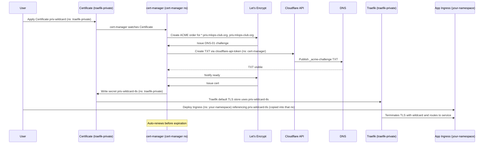

# Wildcard TLS for `*.priv.mlops-club.org` (cert-manager + Traefik)

## Overview

Private ingress now uses a single wildcard cert (`*.priv.mlops-club.org`) issued by cert-manager via Cloudflare DNS-01 and served by Traefik’s default TLS store. Individual services no longer request per-host certs; they reference the shared secret.

## Namespaces and secrets in play
- `cert-manager`: runs cert-manager and holds `cloudflare-api-token`.
- `traefik-private`: runs Traefik and holds the wildcard secret `priv-wildcard-tls`.
- App namespaces (e.g., `whoami-priv`, `default`, or your own): each needs a copy of `priv-wildcard-tls` if the Ingress there references it.

## Architecture

### Components

1. **cert-manager**: Kubernetes operator that manages certificate lifecycle
2. **ClusterIssuer**: Defines Let's Encrypt as the certificate authority
3. **Certificate**: Kubernetes resource that requests the wildcard certificate
4. **Challenge**: DNS-01 challenge that proves domain ownership
5. **Cloudflare API**: Used to create DNS TXT records for validation
6. **Let's Encrypt**: Public CA that issues trusted certificates
7. **Traefik (private)**: Terminates TLS using `priv-wildcard-tls` as default cert on entrypoint `websecure`

### Certificate flow (wildcard)

The following sequence diagram shows how the wildcard cert is obtained and used. Namespaces and secrets are noted.



## How It Works

### 1. Certificate Request

We create one `Certificate` in `traefik-private`:

```yaml
apiVersion: cert-manager.io/v1
kind: Certificate
metadata:
  name: priv-wildcard
  namespace: traefik-private
spec:
  secretName: priv-wildcard-tls
  issuerRef:
    name: letsencrypt-cloudflare
    kind: ClusterIssuer
  dnsNames:
    - "*.priv.mlops-club.org"
    - priv.mlops-club.org
```

### 2. DNS Challenge

cert-manager uses DNS-01 challenge which:
- Creates a TXT record in Cloudflare DNS via API
- Uses the Cloudflare API token from the secret `cloudflare-api-token`
- Proves domain ownership without exposing the service publicly

### 3. Certificate Issuance

Let's Encrypt:
- Verifies the DNS TXT record exists
- Issues a certificate valid for 90 days
- Signs it with Let's Encrypt's trusted CA

### 4. Certificate Storage

The wildcard certificate and private key are stored in:
- **Secret**: `priv-wildcard-tls`
- **Namespace**: `traefik-private`
- Keys: `tls.crt`, `tls.key`

You must copy this secret into any namespace where an Ingress references it.

### 5. Automatic Renewal

cert-manager automatically:
- Monitors certificate expiration
- Renews certificates 30 days before expiration
- Updates the secret with the new certificate
- Traefik automatically picks up the new certificate

## Configuration

### ClusterIssuer Configuration

The `letsencrypt-cloudflare` ClusterIssuer is configured with:

```yaml
apiVersion: cert-manager.io/v1
kind: ClusterIssuer
spec:
  acme:
    server: https://acme-v02.api.letsencrypt.org/directory
    email: ${ACME_EMAIL}
    solvers:
    - dns01:
        cloudflare:
          apiTokenSecretRef:
            name: cloudflare-api-token
            key: api-token
      selector:
        dnsZones:
        - ${CLOUDFLARE_DOMAIN}
```

### Cloudflare API Token

The Cloudflare API token is stored in:
- **Secret**: `cloudflare-api-token` in `cert-manager` namespace
- **Key**: `api-token`
- **Permissions Required**:
  - `Zone:Zone:Read`
  - `Zone:DNS:Edit`

### Ingress Configuration (using wildcard)

Reference the shared secret in your namespace:

```yaml
metadata:
  annotations:
    traefik.ingress.kubernetes.io/router.entrypoints: websecure
    traefik.ingress.kubernetes.io/router.tls: "true"
spec:
  ingressClassName: traefik-private
  tls:
  - hosts:
    - myapp.priv.mlops-club.org
    secretName: priv-wildcard-tls
  rules:
  - host: myapp.priv.mlops-club.org
    http:
      paths:
      - path: /
        pathType: Prefix
        backend:
          service:
            name: myapp
            port:
              number: 80
```

## Certificate Details

### Current Certificate

- **Subject**: `CN=*.priv.mlops-club.org`
- **Issuer**: `Let's Encrypt`
- **Secret**: `priv-wildcard-tls` (ns: `traefik-private`)
- **Traefik default cert**: set via Helm values `tls.stores.default.defaultCertificate.secretName=priv-wildcard-tls`

### Certificate Files

Managed in Kubernetes secrets only; not exported to the repo. Retrieve if needed:
```bash
kubectl -n traefik-private get secret priv-wildcard-tls -o yaml
```

## Benefits

1. **Publicly Trusted**: Works with all browsers without warnings
2. **Automatic**: No manual certificate management
3. **Auto-Renewal**: Certificates renew automatically before expiration
4. **DNS Challenge**: Works for private services (no public HTTP access needed)
5. **Free**: Let's Encrypt certificates are free

## Troubleshooting

### Check Certificate Status (wildcard)

```bash
kubectl get certificate -n traefik-private priv-wildcard
kubectl describe certificate -n traefik-private priv-wildcard
kubectl get certificaterequest -n traefik-private
kubectl get challenge -n traefik-private
kubectl describe challenge -n traefik-private <name>
kubectl logs -n cert-manager -l app=cert-manager
```

### Common Issues

1. **DNS Propagation**: DNS TXT records may take time to propagate
2. **API Token Permissions**: Ensure Cloudflare API token has DNS:Edit permission
3. **Rate Limits**: Let's Encrypt has rate limits (50 certs/week per domain)
4. **Secret placement**: The TLS secret must exist in the same namespace as the Ingress that references it.

## Security Notes

- The wildcard key is in Kubernetes secrets; do not export/commit it.
- Limit RBAC so only Traefik and designated namespaces can read `priv-wildcard-tls`.
- Cloudflare API token should be scoped (DNS:Edit, Zone:Read) and stored only in `cert-manager` namespace.

## Deploying a new private service (your namespace)

Example for `myteam-priv` namespace and host `app.priv.mlops-club.org`:

```bash
# 1) Create namespace
kubectl create namespace myteam-priv

# 2) Copy the wildcard TLS secret into your namespace
kubectl get secret priv-wildcard-tls -n traefik-private -o yaml \
  | kubectl apply -n myteam-priv -f -

# 3) Deploy your app + service (example)
kubectl -n myteam-priv create deploy app --image=nginx:1.27
kubectl -n myteam-priv expose deploy app --port=80 --name=app

# 4) Create Ingress referencing the wildcard secret
cat <<'EOF' | kubectl apply -f -
apiVersion: networking.k8s.io/v1
kind: Ingress
metadata:
  name: app
  namespace: myteam-priv
  annotations:
    traefik.ingress.kubernetes.io/router.entrypoints: websecure
    traefik.ingress.kubernetes.io/router.tls: "true"
    external-dns.alpha.kubernetes.io/hostname: app.priv.mlops-club.org
spec:
  ingressClassName: traefik-private
  tls:
  - hosts:
    - app.priv.mlops-club.org
    secretName: priv-wildcard-tls
  rules:
  - host: app.priv.mlops-club.org
    http:
      paths:
      - path: /
        pathType: Prefix
        backend:
          service:
            name: app
            port:
              number: 80
EOF
```

DNS: ExternalDNS should create the A/AAAA pointing to the Tailscale LB IP of Traefik (`traefik.priv.mlops-club.org`). Ensure `external-dns` runs and has the correct zone ID.

## Useful debug commands (with sample output)

Check wildcard cert and secret:
```bash
$ kubectl -n traefik-private get certificate priv-wildcard
NAME            READY   SECRET              AGE
priv-wildcard   True    priv-wildcard-tls   3m

$ kubectl -n traefik-private get secret priv-wildcard-tls -o jsonpath='{.type}'
kubernetes.io/tls
```

Check challenges:
```bash
$ kubectl -n traefik-private get challenge
NAME                                        STATE     DOMAIN                AGE
priv-wildcard-1-xxxxxxx-aaaaa               valid     priv.mlops-club.org   2m
```

Verify Traefik uses HTTPS and wildcard cert:
```bash
$ curl -I https://whoami.priv.mlops-club.org
HTTP/2 200

$ openssl s_client -connect whoami.priv.mlops-club.org:443 -servername whoami.priv.mlops-club.org \
    | openssl x509 -noout -subject
subject=CN = *.priv.mlops-club.org
```

Check Traefik values:
```bash
$ helm -n traefik-private get values traefik-private
... tls.stores.default.defaultCertificate.secretName: priv-wildcard-tls
```

If cert not served:
- Restart Traefik after secret change:
  `kubectl -n traefik-private rollout restart deploy/traefik-private`
- Ensure secret exists in the same namespace as the Ingress.

