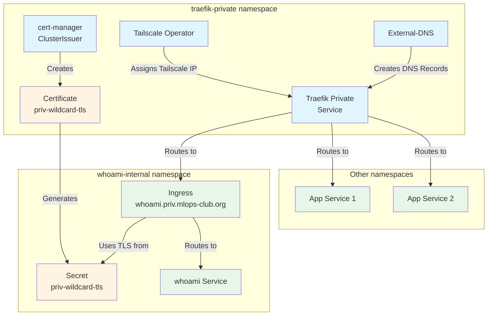
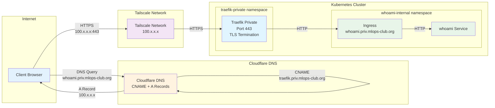
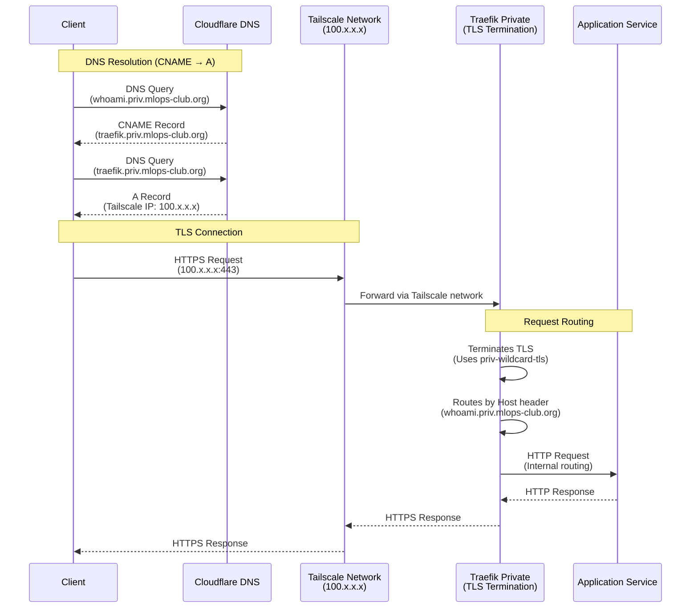
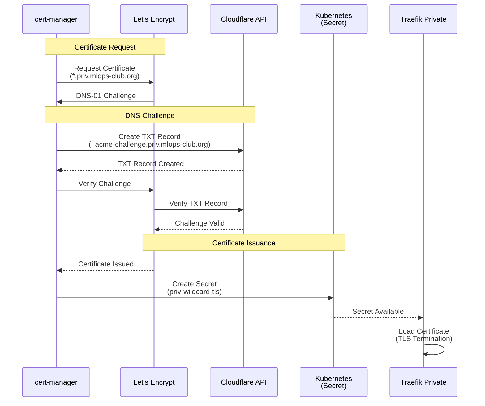

# Private Network Components

This directory contains all components for exposing internal services via Tailscale network with automatic DNS and TLS certificate management.

## Overview

The private network stack provides secure, internal-only access to services through:
- **cert-manager**: Automatic TLS certificate provisioning via Let's Encrypt
- **Tailscale Operator**: Exposes services to Tailscale tailnet
- **External-DNS**: Automatic DNS record management in Cloudflare
- **Traefik**: Reverse proxy and ingress controller for routing

## Architecture

### Resource Diagram



### Network Diagram



### DNS Management

#### DNS Records

| Record Type | Hostname | Target | Source | Managed By |
|-------------|----------|--------|--------|------------|
| **A** | `traefik.priv.mlops-club.org` | Tailscale IP (100.x.x.x) | Traefik LoadBalancer service | External-DNS |
| **CNAME** | `*.priv.mlops-club.org` | `traefik.priv.mlops-club.org` | Ingress annotation: `external-dns.alpha.kubernetes.io/target` | External-DNS |
| **CNAME** | `whoami.priv.mlops-club.org` | `traefik.priv.mlops-club.org` | Ingress annotation: `external-dns.alpha.kubernetes.io/target` | External-DNS |

**How it works:**
1. External-DNS watches for Ingress resources with `external-dns.alpha.kubernetes.io/target` annotation
2. Creates CNAME records pointing to the target (typically `traefik.priv.mlops-club.org`)
3. Creates/maintains A record for `traefik.priv.mlops-club.org` pointing to Traefik's Tailscale IP
4. Tailscale IP comes from the Traefik LoadBalancer service exposed via Tailscale Operator

#### Manual DNS Records

If you need to create DNS records manually:
1. Get Traefik's Tailscale IP:
   ```bash
   kubectl get svc traefik-private -n traefik-private
   ```
2. Create A record in Cloudflare pointing to that IP

### Network Flow Diagram



### Certificate Management Flow

`cert-manager` uses Cloudaflare API keys to perform the DNS-01 challenge automatically to create/renew a certificates (a wildcard certificate for `*.priv.mlops-club.org` in our case).

`cert-manager` stores/updates the value of the certificate in a secret called `priv-wildcard-tls` in the `traefik-private` namespace.



## Components

| Component | Namespace | Purpose | Configuration | Documentation |
|-----------|-----------|---------|---------------|---------------|
| **cert-manager** | `traefik-private` | Automatic TLS certificate provisioning via Let's Encrypt | [`cert-manager/install-cert-manager.sh`](cert-manager/install-cert-manager.sh) | [`cert-manager/LETSENCRYPT_SETUP.md`](cert-manager/LETSENCRYPT_SETUP.md) |
| **Tailscale Operator** | `traefik-private` | Exposes Traefik service to Tailscale tailnet | [`tailscale/values.yaml`](tailscale/values.yaml) | [`tailscale/TAILSCALE_OPERATOR_SETUP.md`](tailscale/TAILSCALE_OPERATOR_SETUP.md) |
| **External-DNS** | `traefik-private` | Automatically creates DNS records in Cloudflare | [`external-dns/values.yaml`](external-dns/values.yaml) | [`external-dns/EXTERNAL_DNS_TAILSCALE_SETUP.md`](external-dns/EXTERNAL_DNS_TAILSCALE_SETUP.md) |
| **Traefik Private** | `traefik-private` | Reverse proxy and ingress controller | [`traefik/values.yaml`](traefik/values.yaml), [`traefik/priv-wildcard-certificate.yaml`](traefik/priv-wildcard-certificate.yaml) | - |

## Installation

### Prerequisites

1. **Cloudflare API Token**: Required for cert-manager and External-DNS
2. **Tailscale OAuth Credentials**: Required for Tailscale Operator
3. **Environment Variables**: Ensure `.env` file is configured with:
   - `CLOUDFLARE_API_TOKEN`
   - `CLOUDFLARE_ACCOUNT_ID`
   - `CLOUDFLARE_ZONE_ID`
   - `CLOUDFLARE_DOMAIN`
   - `ACME_EMAIL`
   - `TAILSCALE_CLIENT_ID`
   - `TAILSCALE_CLIENT_SECRET`

### Quick Start

```bash
# Install all private components (in correct order)
./network/private/helm-install.sh
```

### Installation Order

The installation script follows this order:

1. **cert-manager**: Installs cert-manager and creates ClusterIssuer
2. **Tailscale Operator**: Installs Tailscale operator
3. **External-DNS**: Installs External-DNS for automatic DNS management
4. **Wildcard Certificate**: Creates certificate for `*.priv.mlops-club.org`
5. **Traefik Private**: Installs Traefik with Tailscale LoadBalancer

### Manual Installation

```bash
# 1. Install cert-manager
./network/private/cert-manager/install-cert-manager.sh

# 2. Install Tailscale Operator
./network/private/tailscale/helm-install.sh

# 3. Install External-DNS
./network/private/external-dns/helm-install.sh

# 4. Create wildcard certificate
kubectl apply -f network/private/traefik/priv-wildcard-certificate.yaml

# 5. Install Traefik Private
./network/private/traefik/helm-install.sh
```

### Uninstallation

```bash
# Uninstall all private components
./network/private/helm-uninstall.sh
```

**Note**: cert-manager CRDs are not automatically removed. To remove them:

```bash
kubectl delete -f https://github.com/cert-manager/cert-manager/releases/download/v1.13.3/cert-manager.crds.yaml
```

## Example Services

### Deploy Example whoami Service

```bash
# Deploy whoami service in whoami-internal namespace
./network/private/examples/deploy-whoami-internal.sh
```

The service will be accessible at: `https://whoami.priv.mlops-club.org`

### Example Ingress Configuration

```yaml
apiVersion: networking.k8s.io/v1
kind: Ingress
metadata:
  name: my-app
  namespace: my-namespace
  annotations:
    # External-DNS creates DNS record pointing to Traefik's Tailscale IP
    external-dns.alpha.kubernetes.io/hostname: my-app.priv.mlops-club.org
    external-dns.alpha.kubernetes.io/target: traefik.priv.mlops-club.org
    traefik.ingress.kubernetes.io/router.entrypoints: websecure
    traefik.ingress.kubernetes.io/router.tls: "true"
spec:
  ingressClassName: traefik-private
  tls:
  - hosts:
    - my-app.priv.mlops-club.org
    secretName: priv-wildcard-tls
  rules:
  - host: my-app.priv.mlops-club.org
    http:
      paths:
      - path: /
        pathType: Prefix
        backend:
          service:
            name: my-app
            port:
              number: 80
```

**Important**: Copy the `priv-wildcard-tls` secret to your namespace:

```bash
kubectl get secret priv-wildcard-tls -n traefik-private -o yaml \
  | sed 's/namespace: traefik-private/namespace: my-namespace/' \
  | kubectl apply -n my-namespace -f -
```

## TLS Certificates

### Wildcard Certificate

- **Domain**: `*.priv.mlops-club.org` and `priv.mlops-club.org`
- **Issuer**: `letsencrypt-cloudflare` (ClusterIssuer)
- **Challenge**: DNS-01 via Cloudflare API
- **Secret**: `priv-wildcard-tls` in `traefik-private` namespace
- **Auto-renewal**: Managed by cert-manager

### Certificate Sharing

To use the wildcard certificate in other namespaces:

1. Copy the secret to your namespace (see example above)
2. Reference it in your Ingress TLS configuration

## Troubleshooting

### Service Not Accessible

1. **Check Tailscale connectivity**:
   ```bash
   kubectl get svc traefik-private -n traefik-private
   # Should show Tailscale IP (100.x.x.x) in EXTERNAL-IP
   ```

2. **Check DNS records**:
   ```bash
   # Verify DNS record exists in Cloudflare
   dig whoami.priv.mlops-club.org
   ```

3. **Check certificate status**:
   ```bash
   kubectl get certificate -n traefik-private
   kubectl describe certificate priv-wildcard -n traefik-private
   ```

4. **Check External-DNS logs**:
   ```bash
   kubectl logs -n traefik-private -l app.kubernetes.io/name=external-dns
   ```

### Certificate Issues

1. **Certificate not ready**:
   ```bash
   kubectl get certificate priv-wildcard -n traefik-private
   kubectl describe certificate priv-wildcard -n traefik-private
   ```

2. **Check cert-manager logs**:
   ```bash
   kubectl logs -n traefik-private -l app.kubernetes.io/instance=cert-manager
   ```

3. **Verify ClusterIssuer**:
   ```bash
   kubectl get clusterissuer letsencrypt-cloudflare
   kubectl describe clusterissuer letsencrypt-cloudflare
   ```

### Tailscale Issues

1. **Check Tailscale operator**:
   ```bash
   kubectl get pods -n traefik-private -l app=tailscale-operator
   kubectl logs -n traefik-private -l app=tailscale-operator
   ```

2. **Verify Tailscale device**:
   - Check Tailscale admin console for operator device
   - Verify device has correct tags and ACL permissions

## Related Documentation

- `cert-manager/LETSENCRYPT_SETUP.md` - Let's Encrypt certificate setup
- `tailscale/TAILSCALE_OPERATOR_SETUP.md` - Tailscale operator setup
- `external-dns/EXTERNAL_DNS_TAILSCALE_SETUP.md` - External-DNS configuration

## Directory Structure

```
private/
├── cert-manager/
│   ├── install-cert-manager.sh
│   └── LETSENCRYPT_SETUP.md
├── tailscale/
│   ├── helm-install.sh
│   ├── values.yaml
│   └── TAILSCALE_OPERATOR_SETUP.md
├── external-dns/
│   ├── helm-install.sh
│   ├── values.yaml
│   └── EXTERNAL_DNS_TAILSCALE_SETUP.md
├── traefik/
│   ├── helm-install.sh
│   ├── values.yaml
│   └── priv-wildcard-certificate.yaml
├── examples/
│   ├── deploy-whoami-internal.sh
│   ├── whoami-internal.yaml
│   └── [other examples]
├── helm-install.sh
├── helm-uninstall.sh
└── README.md (this file)
```

