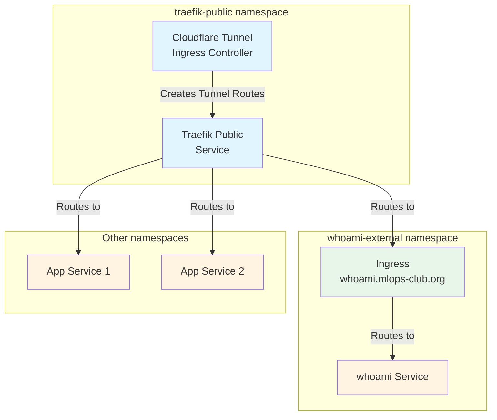
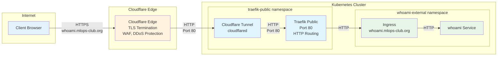
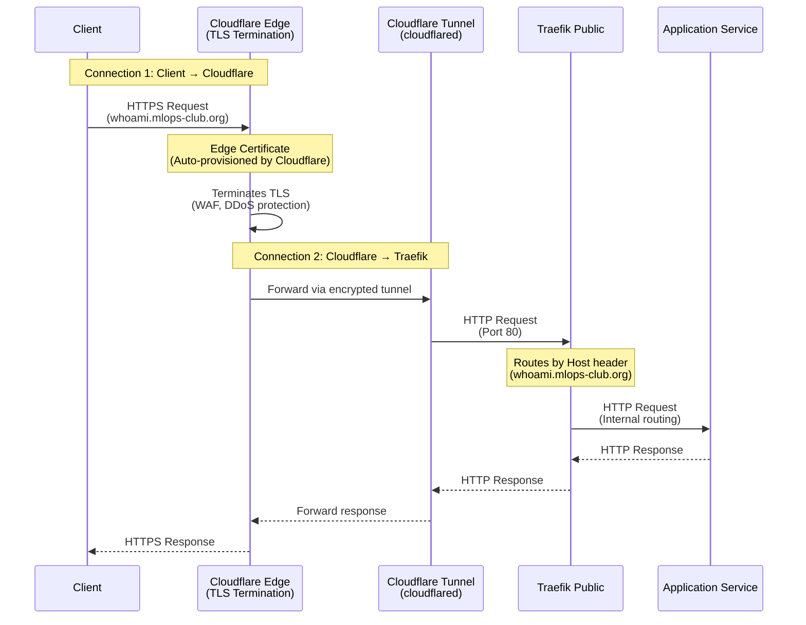
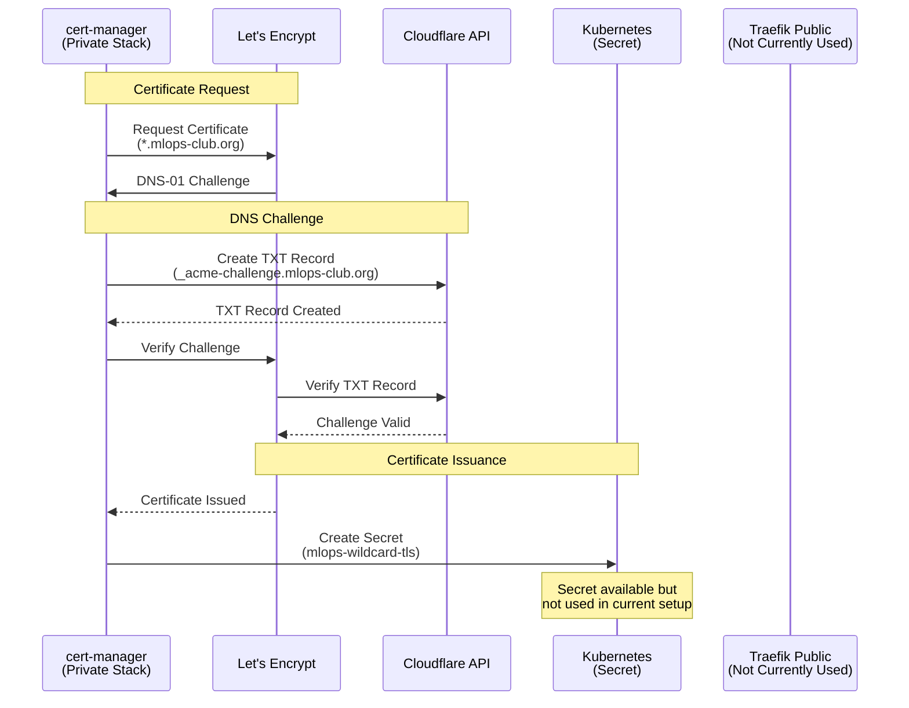

# Public Network Components

This directory contains all components for exposing public-facing services via Cloudflare Tunnel and Traefik.

## Overview

The public network stack provides secure, public access to services through:
- **Cloudflare Tunnel**: Encrypted tunnel from Cloudflare edge to your cluster
- **Traefik**: Reverse proxy and ingress controller for routing
- **TLS Termination**: Handled at Cloudflare edge only (Traefik receives HTTP traffic)

## Architecture

### Resource Diagram



### Network Diagram



### DNS Configuration

#### DNS Records

| Record Type | Hostname | Target | Source | Managed By |
|-------------|----------|--------|--------|------------|
| **Tunnel Route** | `*.mlops-club.org` | `k3s-tunnel` → Traefik service (ClusterIP) `http://traefik-public.traefik-public.svc.cluster.local:80` | Cloudflare Tunnel Ingress Controller | Cloudflare Tunnel |
| **Tunnel Route** | `traefik.mlops-club.org` | `k3s-tunnel` → Traefik service (ClusterIP) `http://traefik-public.traefik-public.svc.cluster.local:80` | [`traefik/traefik-ingress.yaml`](traefik/traefik-ingress.yaml) | Cloudflare Tunnel |

**How it works:**
1. Cloudflare Tunnel Ingress Controller watches for Ingress resources with `ingressClassName: cloudflare-tunnel`
2. Creates tunnel routes in Cloudflare pointing to the backend service
3. No DNS A records needed - Cloudflare Tunnel handles routing internally
4. All `*.mlops-club.org` subdomains are routed to Traefik via the tunnel

### Network Flow Diagram



### Certificate Management Flow

**Note**: In the current configuration, TLS termination only happens at Cloudflare edge. Traefik receives HTTP traffic on port 80. The certificate management flow below shows how certificates *could* be managed if TLS termination at Traefik were enabled, but it's not currently used in this setup.



## Components

| Component | Namespace | Purpose | Configuration | Documentation |
|-----------|-----------|---------|---------------|---------------|
| **Cloudflare Tunnel Ingress Controller** | `traefik-public` | Automatically creates Cloudflare Tunnel routes for Kubernetes Ingress resources | [`cloudflare-tunnel-ingress-controller/values.yaml`](cloudflare-tunnel-ingress-controller/values.yaml) | [`cloudflare-tunnel-ingress-controller/CLOUDFLARE_TUNNEL_SETUP.md`](cloudflare-tunnel-ingress-controller/CLOUDFLARE_TUNNEL_SETUP.md) |
| **Traefik Public** | `traefik-public` | Reverse proxy and ingress controller for routing requests to services | [`traefik/values.yaml`](traefik/values.yaml), [`traefik/traefik-ingress.yaml`](traefik/traefik-ingress.yaml) | [`traefik/TLS_ARCHITECTURE.md`](traefik/TLS_ARCHITECTURE.md), [`traefik/DNS_SETUP.md`](traefik/DNS_SETUP.md) |

## Installation

### Quick Start

```bash
# Install all public components
./network/public/helm-install.sh
```

### Manual Installation

```bash
# 1. Install Cloudflare Tunnel Ingress Controller
./network/public/cloudflare-tunnel-ingress-controller/helm-install.sh

# 2. Install Traefik Public
./network/public/traefik/helm-install.sh
```

### Uninstallation

```bash
# Uninstall all public components
./network/public/helm-uninstall.sh
```

## Example Services

### Deploy Example whoami Service

```bash
# Deploy whoami service in whoami-external namespace
./network/public/examples/deploy-whoami-external.sh
```

The service will be accessible at: `https://whoami.mlops-club.org`

### Example Ingress Configuration

```yaml
apiVersion: networking.k8s.io/v1
kind: Ingress
metadata:
  name: my-app
  namespace: my-namespace
  annotations:
    traefik.ingress.kubernetes.io/router.entrypoints: websecure
    traefik.ingress.kubernetes.io/router.tls: "true"
spec:
  ingressClassName: traefik-public
  tls:
  - hosts:
    - my-app.mlops-club.org
    secretName: mlops-wildcard-tls
  rules:
  - host: my-app.mlops-club.org
    http:
      paths:
      - path: /
        pathType: Prefix
        backend:
          service:
            name: my-app
            port:
              number: 80
```

**Note**: No Cloudflare Tunnel Ingress annotation needed! The catch-all Ingress in `traefik-public` namespace routes all `*.mlops-club.org` traffic to Traefik, which then routes based on the Host header.

## TLS Certificates

### Single-Level TLS Architecture

**Cloudflare Edge Certificate** (Automatic)
- Managed by Cloudflare
- Encrypts Client → Cloudflare connection
- Auto-provisioned when domain is added to Cloudflare
- TLS is terminated at Cloudflare edge only

**Note**: In the current configuration, Cloudflare Tunnel connects to Traefik via HTTP (port 80). TLS termination happens only at the Cloudflare edge. Traefik receives unencrypted HTTP traffic internally.

See `traefik/TLS_ARCHITECTURE.md` for detailed explanation (note: that document describes a two-level TLS setup, but the current configuration uses single-level TLS at Cloudflare edge only).

## Troubleshooting

### Service Not Accessible

1. **Check Cloudflare Tunnel status**:
   ```bash
   kubectl get pods -n traefik-public
   kubectl logs -n traefik-public -l app=cloudflare-tunnel-ingress-controller
   ```

2. **Check Traefik status**:
   ```bash
   kubectl get pods -n traefik-public
   kubectl get ingress -n traefik-public
   ```

3. **Verify Ingress configuration**:
   ```bash
   kubectl describe ingress <ingress-name> -n <namespace>
   ```

4. **Check Cloudflare Dashboard**:
   - SSL/TLS → Edge Certificates (should show active certificate)
   - SSL/TLS mode should be "Full" or "Full (strict)"

### TLS Certificate Issues

- **Edge certificate not ready**: Wait 5-15 minutes after adding domain to Cloudflare
- **Origin certificate missing**: Ensure cert-manager is installed and `mlops-wildcard-tls` secret exists

## Related Documentation

- `traefik/TLS_ARCHITECTURE.md` - Detailed TLS certificate architecture
- `traefik/DNS_SETUP.md` - DNS configuration guide
- `traefik/FREE_SSL_SOLUTION.md` - SSL/TLS setup guide
- `cloudflare-tunnel-ingress-controller/CLOUDFLARE_TUNNEL_SETUP.md` - Tunnel setup guide

## Directory Structure

```
public/
├── cloudflare-tunnel-ingress-controller/
│   ├── helm-install.sh
│   ├── values.yaml
│   └── CLOUDFLARE_TUNNEL_SETUP.md
├── traefik/
│   ├── helm-install.sh
│   ├── values.yaml
│   ├── traefik-ingress.yaml
│   └── [documentation files]
├── examples/
│   ├── deploy-whoami-external.sh
│   └── whoami-external.yaml
├── helm-install.sh
├── helm-uninstall.sh
└── README.md (this file)
```

