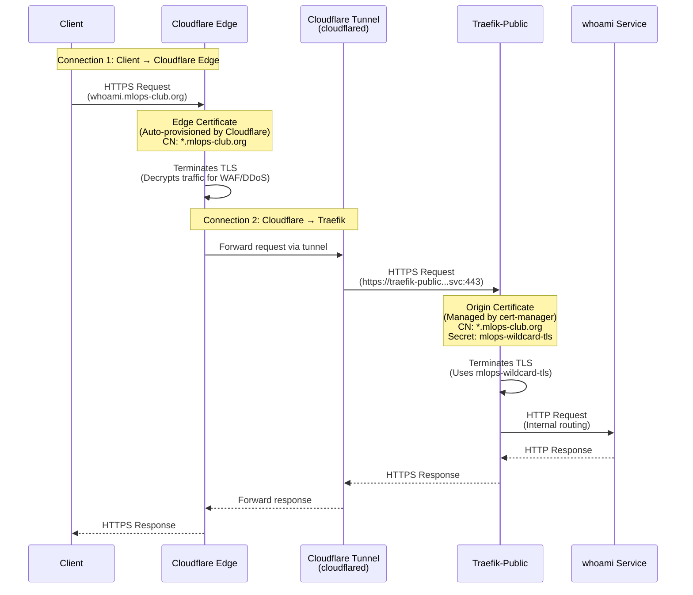

# TLS Certificate Architecture: Cloudflare Tunnel + Traefik

## Understanding the Two Certificates

When using Cloudflare Tunnel with Traefik, there are **TWO separate TLS connections**, each requiring a certificate:

### Current Architecture

## Certificate Responsibilities

### 1. Cloudflare Edge Certificate (Automatic)
- **Who manages it**: Cloudflare automatically
- **Purpose**: Encrypts Client → Cloudflare connection
- **Location**: Cloudflare's edge network
- **Provisioning**: Automatic when domain is added to Cloudflare
- **You don't manage this**: Cloudflare handles it automatically

### 2. Traefik Origin Certificate (Your cert-manager)
- **Who manages it**: You (via cert-manager)
- **Purpose**: Encrypts Cloudflare Tunnel → Traefik connection
- **Location**: Kubernetes secret `mlops-wildcard-tls`
- **Provisioning**: cert-manager via Let's Encrypt DNS-01 challenge
- **You manage this**: This is what we configured

## Why Cloudflare Needs an Edge Certificate

**Cloudflare Tunnel ALWAYS terminates TLS at the edge** because:
1. **Security Features**: Cloudflare needs to decrypt traffic to apply:
   - WAF (Web Application Firewall) rules
   - DDoS protection
   - Bot management
   - Rate limiting
2. **Performance**: Cloudflare caches and optimizes content
3. **Architecture**: This is how Cloudflare Tunnel works - it's not optional

**You cannot bypass this** - Cloudflare will always terminate TLS at the edge.

## What You Control

✅ **You control**: Traefik's certificate (via cert-manager)
- This encrypts the connection from Cloudflare Tunnel to Traefik
- Managed by cert-manager → Let's Encrypt → Kubernetes secret

❌ **You don't control**: Cloudflare's edge certificate
- Automatically provisioned by Cloudflare
- You just need to wait for it to be ready (usually 5-15 minutes)

## The Current Issue

The SSL handshake failure is happening at **Connection 1** (Client → Cloudflare Edge):
- Cloudflare hasn't finished provisioning the edge certificate yet
- OR there's a configuration mismatch

This is **NOT** a problem with your Traefik certificate - that's working fine.

## Solution: Wait for Cloudflare Edge Certificate

1. **Check Cloudflare Dashboard** → SSL/TLS → Edge Certificates
2. **Look for**: Active certificate for `*.mlops-club.org`
3. **If missing**: Wait 5-15 minutes for automatic provisioning
4. **If present but still failing**: Check SSL/TLS mode is "Full (strict)"

## Alternative: Bypass Cloudflare Tunnel (Not Recommended)

If you want Traefik to handle ALL TLS without Cloudflare:
- Remove Cloudflare Tunnel
- Expose Traefik directly (requires public IP, firewall rules, etc.)
- Traefik would handle Client → Traefik TLS directly
- **Tradeoff**: Lose Cloudflare's DDoS protection, WAF, caching, etc.

## Summary

- **Two certificates**: Edge (Cloudflare auto) + Origin (your cert-manager)
- **You manage**: Only the Traefik certificate (already done ✅)
- **Cloudflare manages**: Edge certificate (automatic, just wait)
- **Current issue**: Edge certificate not ready yet (propagation delay)

