# Storage

This folder documents the cluster storage approach and the Harbor registry deployment. It includes:

- `storage/nfs/`: NFS CSI driver install and the `nas-nfs` StorageClass
- `storage/harbor-nfs-debug.md`: deep-dive debug notes
- `storage/README.md`: this overview

## Usage
You must be on the tailnet to reach `cr.priv.mlops-club.org`.

1) Docker login and push

```bash
docker login cr.priv.mlops-club.org -u admin
docker tag local-image:latest cr.priv.mlops-club.org/come-follow-me-app/local-image:0.1.0
docker push cr.priv.mlops-club.org/come-follow-me-app/local-image:0.1.0
```

2) Create a project for versioned images

Projects are namespaces in Harbor. Create one once, then push multiple tags to it.

UI steps:
- Open `https://cr.priv.mlops-club.org` (tailnet only).
- Create a project named `come-follow-me-app` (private is fine).

Then push versions as tags:

```bash
docker tag local-image:latest cr.priv.mlops-club.org/come-follow-me-app/local-image:0.1.0
docker tag local-image:latest cr.priv.mlops-club.org/come-follow-me-app/local-image:0.1.1
docker push cr.priv.mlops-club.org/come-follow-me-app/local-image:0.1.0
docker push cr.priv.mlops-club.org/come-follow-me-app/local-image:0.1.1
```

3) Reference an image in a Kubernetes manifest

```yaml
apiVersion: apps/v1
kind: Deployment
metadata:
  name: example-app
spec:
  replicas: 1
  selector:
    matchLabels:
      app: example-app
  template:
    metadata:
      labels:
        app: example-app
    spec:
      imagePullSecrets:
        - name: harbor-creds
      containers:
        - name: app
          image: cr.priv.mlops-club.org/come-follow-me-app/local-image:0.1.0
          ports:
            - containerPort: 8080
```

Create the pull secret once per namespace:

```bash
kubectl -n <namespace> create secret docker-registry harbor-creds \
  --docker-server=cr.priv.mlops-club.org \
  --docker-username=admin \
  --docker-password="$HARBOR_ADMIN_PASSWORD"
```

## Approach summary
We use a NAS-backed NFS StorageClass (`nas-nfs`) for durable, shared storage that survives node rebuilds. Harbor (our private registry) stores its data on the NAS, and we expose the UI internally via Traefik (`cr.priv.mlops-club.org`).

We considered `local-path` (node-local storage) and other options, but NFS gave us the best balance of durability and simplicity for the homelab. The tradeoffs and alternatives are documented below.

## Kubernetes storage 101 (PVC, PV, StorageClass)
Kubernetes storage has three key building blocks:

- StorageClass (SC): a template that tells Kubernetes *how* to provision storage.
- PersistentVolume (PV): the actual provisioned storage resource.
- PersistentVolumeClaim (PVC): a pod's request for storage; it binds to a PV.

Basic flow:

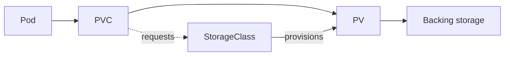

For NFS, the backing storage is a NAS export subdirectory. For `local-path`, it is a directory on the node's filesystem.

### Storage classes in this homelab

1) `nas-nfs` (NFS CSI driver)
- Backed by the NAS export `/volume1/k8s-homelab` on `100.117.142.58`.
- Each PVC gets a unique subdirectory under the export.
- Good for durability and shared access across nodes.

2) `local-path` (k3s default)
- Backed by a local directory on a specific node.
- Good for simple workloads or caches.
- Not durable across node loss or rescheduling.

Other storage classes you could add (not required here):
- Longhorn / OpenEBS (replicated block storage)
- iSCSI / Ceph / Rook (more complex, more moving parts)

## Harbor overview
Harbor is a private OCI registry with a web UI, RBAC, and project-based namespaces. In this cluster we run it in the `image-registry` namespace and expose it through the private Traefik ingress.

### Architecture (Harbor + NAS)

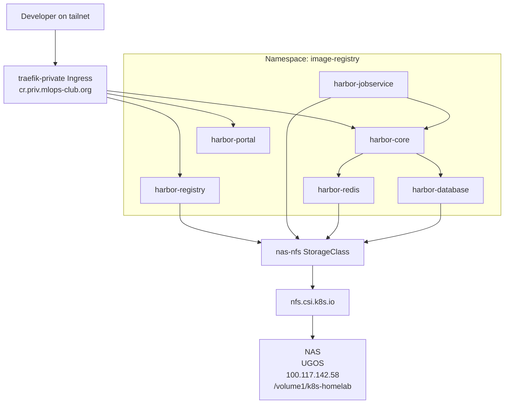

### Storage provisioning flow (NFS)

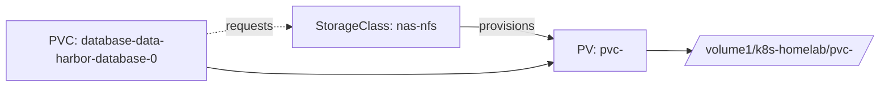

### Harbor request path (login and push)

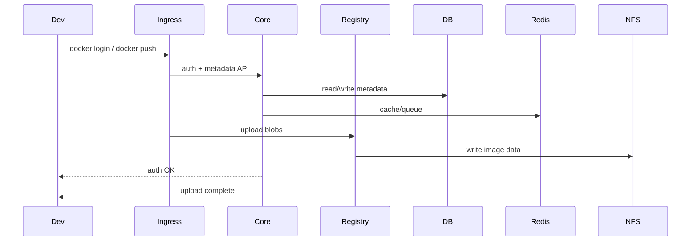

## NAS setup (UGOS)
I enabled NFS in UGOS and created the export folder under `/volume1`:

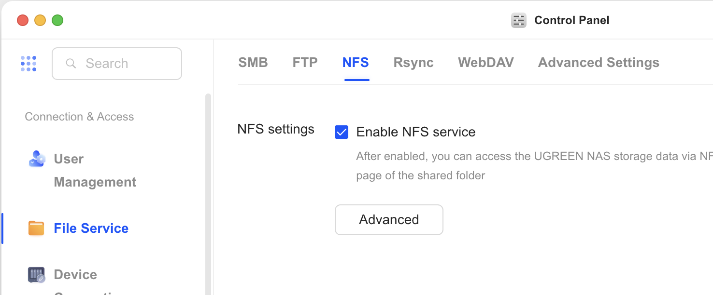

By this point, the NAS exports showed the folder:

```bash
showmount -e 100.117.142.58
```

```
Exports list on 100.117.142.58:
/volume1/k8s-homelab
```

I then configured NFS permissions in UGOS:

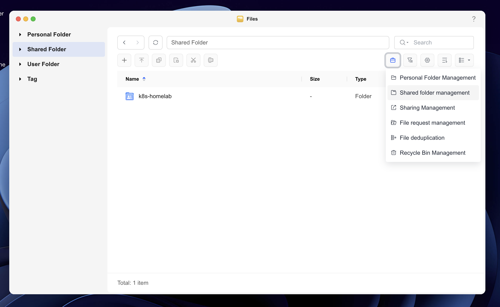
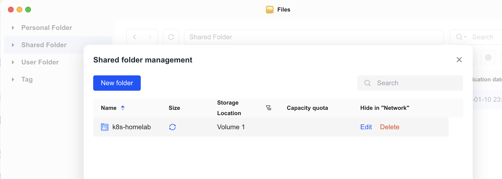
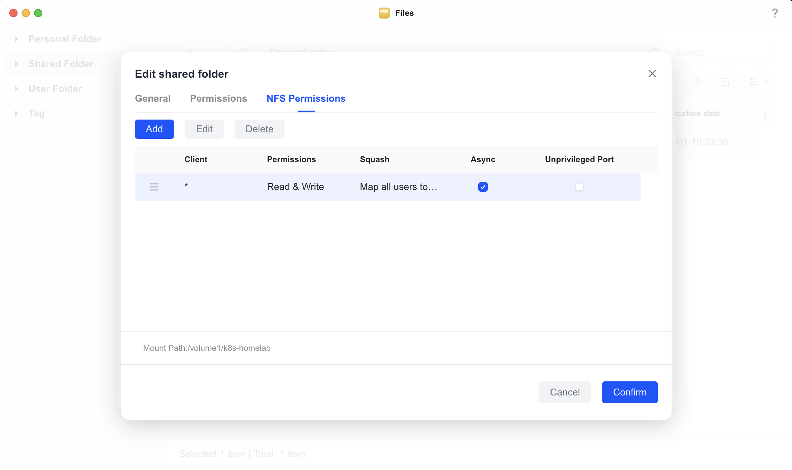
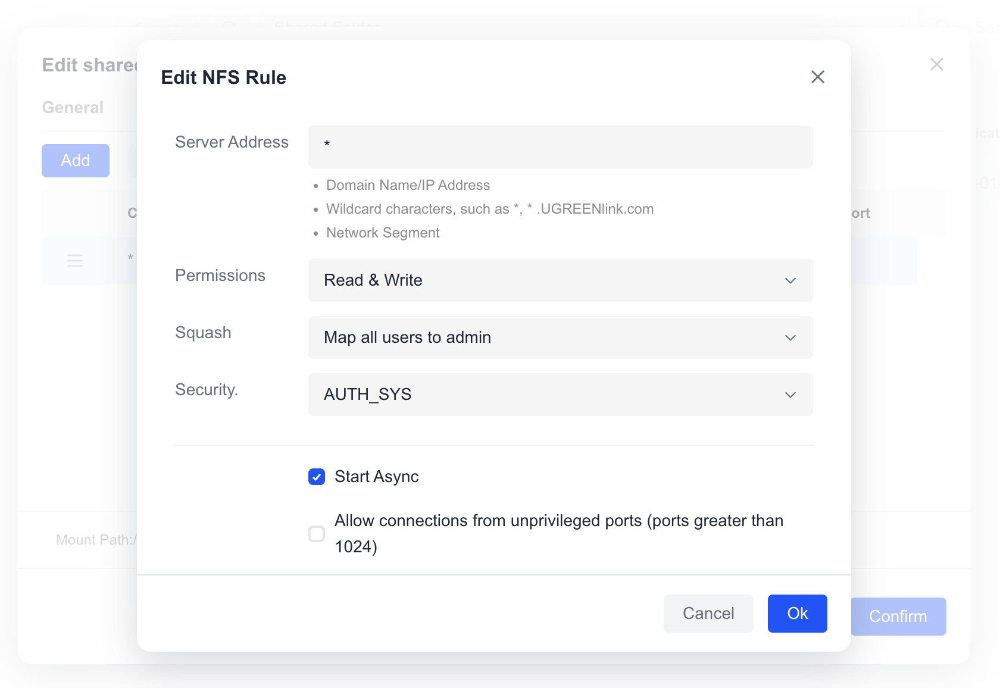
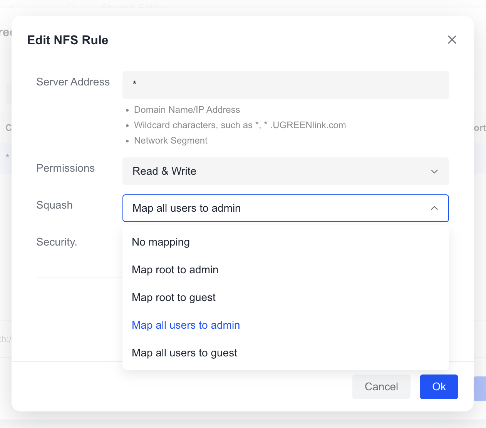

## Squash rules (what they are and why they mattered)
Squash rules control *who the NAS thinks you are* when you access the share:

- `no_root_squash`: client root stays root on the NAS (UID 0).
- `root_squash`: client root is mapped to a low-privilege anonymous user (often UID 65534).
- `all_squash` / mapall: every client user is mapped to one UID/GID.

In many NAS UIs these appear as "map root to admin/guest" or "map all users to admin/guest". Under the hood they are NFS export flags that rewrite the UID/GID the server sees (maproot, mapall, anonuid, anongid).

Why this matters: Kubernetes kubelet applies `fsGroup` during the mount by doing `chown`/`chmod` as root. If the server squashes root into a non-root UID, those ownership changes are blocked and the pod never starts.

### Permission mapping visual

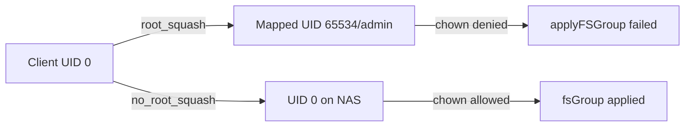

## Troubleshooting the Harbor database mount
Harbor's Postgres container runs as UID 999 and the chart sets `fsGroup: 999`.

```yaml
# kubectl -n image-registry get statefulset harbor-database -o yaml
spec:
  template:
    spec:
      securityContext:
        runAsUser: 999
        fsGroup: 999
```

That means kubelet tries to apply the ownership change during mount. With root squashed, the mount fails before the init container even starts.

### Failure sequence (install -> squash -> mount error)

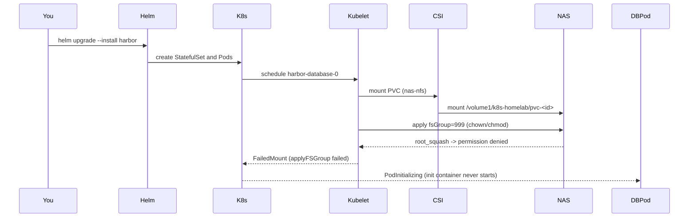

Evidence in logs:

```bash
kubectl -n image-registry describe pod harbor-database-0
```

```
Warning  FailedMount  MountVolume.SetUp failed for volume "pvc-..." :
applyFSGroup failed for vol 100.117.142.58#volume1/k8s-homelab#pvc-...##:
open /var/lib/kubelet/pods/.../mount: permission denied
```

And the dependent pods showed connection failures because the DB never came up:

```bash
kubectl -n image-registry logs harbor-core-... --previous
```

```
failed to connect to tcp://harbor-database:5432 ... connection refused
```

### Fix sequence (no_root_squash -> remount -> success)

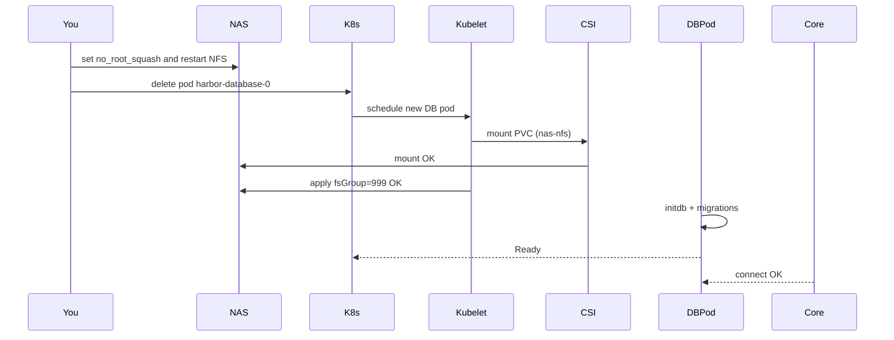

After the change:

```bash
kubectl -n image-registry logs harbor-database-0 --tail=200
```

```
LOG:  database system is ready to accept connections
```

## Alternatives and tradeoffs
We considered other approaches before pushing through the NFS fix:

1) Use `local-path` for the database and Redis, keep only registry blobs on NFS
- Pros: avoids NFS ownership issues entirely.
- Cons: data becomes node-local; if the node dies or the pod reschedules, the DB is gone unless you restore backups.

2) Use an external Postgres (VM or managed service) and keep only registry blobs on NFS
- Pros: stable database with fewer NFS permission edge cases.
- Cons: more infra to manage; backups and upgrades move outside the cluster.

3) Run a different NFS server (TrueNAS or a Linux VM)
- Pros: full control over maproot/no_root_squash/anonuid; better NFS tooling.
- Cons: adds a new system to operate; more moving pieces in the homelab.

4) Use SMB/WebDAV/FTP instead of NFS
- Pros: easier to expose from consumer NAS devices.
- Cons: not a great fit for Kubernetes PVCs and database workloads; no CSI driver support for our setup.

## Why we chose NFS anyway
We already had a NAS with plenty of storage and wanted the registry data to survive node rebuilds. NFS keeps the cluster simple (no extra database VM, no external services) and keeps all Harbor data in one place. Once the export rules were fixed, the system behaved like a normal Kubernetes storage backend, which is exactly what we wanted.

## Verification checks

```bash
kubectl -n image-registry get pods
kubectl -n image-registry get ingress
```

Expected:

- `harbor-core`, `harbor-registry`, `harbor-portal`, `harbor-jobservice`, `harbor-redis`, `harbor-database` are all `Running`.
- Ingress `harbor-ingress` points at `cr.priv.mlops-club.org`.
