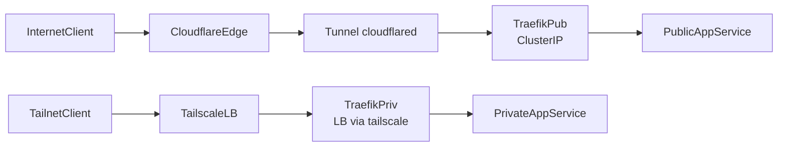
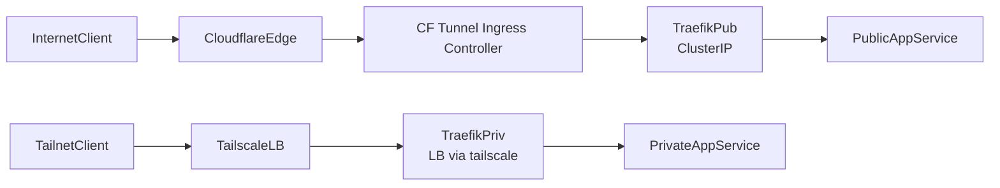
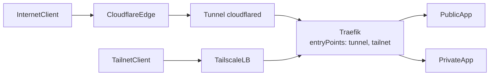

# Traefik public/private ingress options

This document outlines several workable ingress patterns for k3s where Traefik handles routing for both public traffic (via Cloudflare Tunnel) and private traffic (via Tailscale). Each option includes a diagram, required components, and tradeoffs. Traefik remains the primary ingress; Cloudflare Tunnel or Tailscale provide transport into the cluster.

## Sources (feasibility evidence)
- Traefik ACME & Cloudflare DNS-01: https://doc.traefik.io/traefik/https/acme/#providers
- Traefik Kubernetes CRDs (IngressRoute, TLSOptions): https://doc.traefik.io/traefik/routing/providers/kubernetes-crd/
- Cloudflare Tunnel Ingress Controller: https://github.com/STRRL/cloudflare-tunnel-ingress-controller
- Cloudflare Tunnel docs (originless ingress): https://developers.cloudflare.com/cloudflare-one/connections/connect-apps/
- Tailscale Kubernetes operator (LoadBalancer class `tailscale`, annotation `tailscale.com/expose`): https://tailscale.com/kb/1320/kubernetes-operator
- ExternalDNS Cloudflare provider: https://github.com/kubernetes-sigs/external-dns/blob/master/docs/tutorials/cloudflare.md

## Option A — Dual Traefik + cloudflared tunnel (sidecar/DaemonSet)
Use Traefik as the only ingress controller. Public traffic reaches Traefik through a Cloudflare Tunnel agent (cloudflared) that forwards to Traefik’s ClusterIP. Private traffic enters via a Tailscale LoadBalancer service in front of the private Traefik.

Components:
- Traefik-pub (ClusterIP) + IngressClass `traefik-pub`
- Traefik-priv (LoadBalancer, class `tailscale`) + IngressClass `traefik-priv`
- cloudflared deployment/DaemonSet with Ingress rule forwarding `*.pub.mlops-club.org` to Traefik-pub
- ExternalDNS (Cloudflare) for `*.priv.mlops-club.org` A/AAAA to the Tailscale IP
- Shared TLS secret (optional initially) or ACME DNS-01 via Cloudflare

Tradeoffs:
- Pros: Single ingress technology (Traefik) for both paths; no extra Kubernetes ingress controller; clear separation of pub/priv.
- Cons: You manage tunnel config yourself (helm values or manifest); need to operate two Traefik releases.

## Option B — Traefik + Cloudflare Tunnel Ingress Controller
Use the Cloudflare Tunnel Ingress Controller to program tunnels from standard Kubernetes Ingress resources. Traefik still terminates HTTP routing; controller just delivers traffic to Traefik’s ClusterIP.

Components:
- Traefik-pub (ClusterIP) + IngressClass `traefik-pub`
- Cloudflare Tunnel Ingress Controller handling `Ingress` with `ingressClassName: cloudflare-tunnel`
- Traefik-priv with Tailscale LoadBalancer
- ExternalDNS for private DNS records

Tradeoffs:
- Pros: Controller manages tunnel lifecycle, DNS, cert pinning automatically; K8s-native UX for developers using standard Ingress.
- Cons: Extra controller to operate; ingressClass split (cloudflare-tunnel vs traefik-pub) can be confusing; less control over tunnel process details.

## Option C — Single Traefik with dual entrypoints (tailnet + tunnel port)
Run one Traefik instance with two entrypoints: one bound to a Tailscale LB address and one only reachable inside the cluster for cloudflared to forward to. Use routers with `entryPoints` selectors to keep pub/priv isolated logically.

Components:
- One Traefik release; entrypoints `tailnet` (LoadBalancer class tailscale) and `tunnel` (ClusterIP)
- cloudflared forwards to `tunnel` entrypoint
- Routers use `entryPoints` to enforce pub vs priv

Tradeoffs:
- Pros: Fewer deployments; simpler upgrades.
- Cons: Blast-radius coupling (one Traefik); need careful config to avoid cross-route leakage; log/metrics harder to separate.

## Option D — Traefik-priv only + Tailscale; public apps use direct Cloudflare Tunnel (no Traefik)
For completeness: internal uses Traefik+Tailscale; public apps mount their own cloudflared sidecar per Deployment.

Tradeoffs:
- Pros: Minimal shared infra for public; isolation per app.
- Cons: Duplicated tunnel config per service; uneven developer UX; not preferred here.

## Recommended path
Adopt **Option A** (Traefik-first, cloudflared forwarding) as default. Keep Option B documented if you later want controller-managed tunnels. Option C is viable for smaller clusters but less isolation.

## Developer experience (Ingress examples)
- Public app: `IngressRoute` (or Ingress) with `ingressClassName: traefik-pub`, host `app.pub.mlops-club.org`.
- Private app: `IngressRoute` with `ingressClassName: traefik-priv`, host `app.priv.mlops-club.org`; ExternalDNS annotation for A/AAAA to Tailscale IP.

## TLS plan (automation-first)
- Public (via Cloudflare):
  - Short term: Cloudflare origin cert secret `cloudflare-origin-cert` in Traefik namespaces.
  - Long term: Traefik ACME DNS-01 with Cloudflare API token (`CF_DNS_API_TOKEN`) and wildcard certs (`*.pub.mlops-club.org`, `*.priv.mlops-club.org`) per https://doc.traefik.io/traefik/https/acme/#providers.
  - Traefik values: set `certificatesResolvers.cloudflare.acme.dnsChallenge.provider=cloudflare`, `email`, and default TLS store referencing `acme.json` (mounted RW).
- Private (tailnet):
  - Option 1: reuse the same Cloudflare-issued cert; trust enforced by Tailscale network identity.
  - Option 2: internal CA or Traefik ACME wildcard as above; distribute trust to tailnet clients (via Tailscale device trust or manual CA import).
- Rotation:
  - If using ACME, Traefik auto-renews; back up `acme.json` secret and reload pods on change.
  - If using Cloudflare origin cert, track expiry and replace secret; roll Traefik Deployments to pick up new cert.

## Operational considerations
- Observability: Enable Traefik Prometheus + access logs per ingress class.
- Secret handling: central TLS secret (Cloudflare origin or ACME DNS-01) copied into namespaces; automate rotation.
- Failure domains: pub/priv Traefik separated (Option A/B), reducing cross-impact.
- Cost: All components use free tiers (Cloudflare free plan, Tailscale free/personal tailnet limits; verify device caps).

